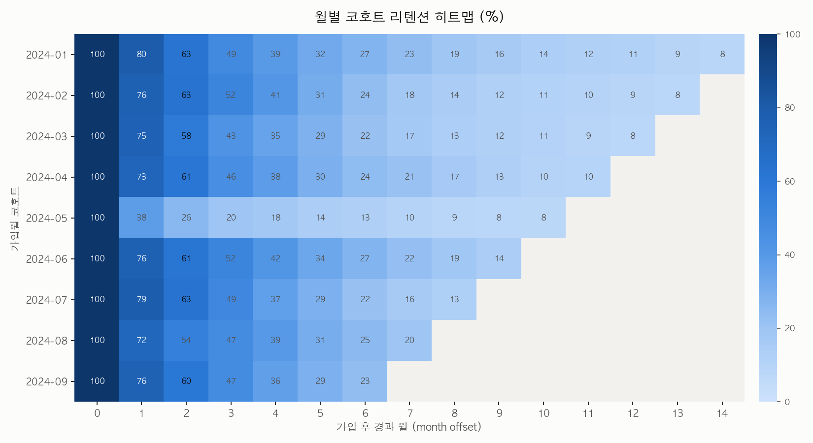
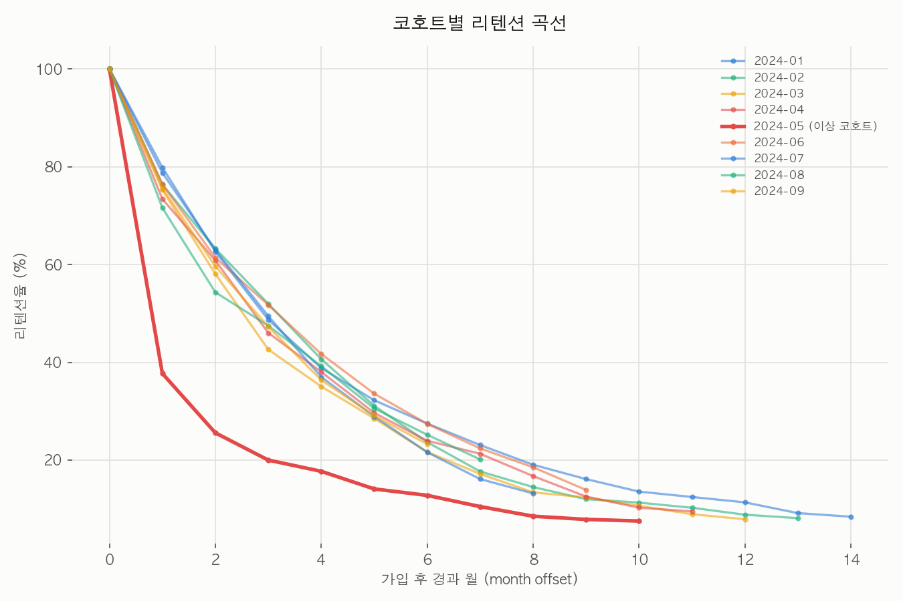
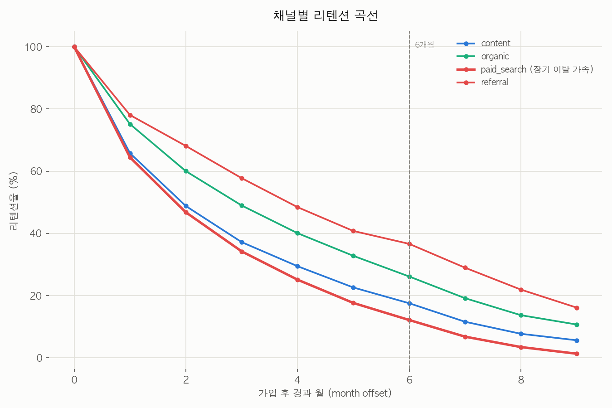

# 📊 Cohort Retention Analysis — SQL과 pandas로 하는 코호트 리텐션 분석

## 개요

코호트 리텐션은 "가입월이 같은 유저 그룹(코호트)이 시간이 지나며 얼마나 남아있는가"를 추적하는 분석입니다. 평균 리텐션 하나만 보면 특정 시기의 온보딩 문제나 특정 채널의 저품질 유입을 놓치기 쉽습니다. 코호트별로 쪼개 보는 순간 "언제, 누가, 왜 이탈했는가"가 보이기 시작합니다.

프로덕트/그로스 분석에서 가장 기본이 되는 분석이면서도, 구현은 groupby 하나와 SQL 윈도우 함수 몇 줄로 끝나는 가성비 좋은 레시피입니다.

## 데이터 (Data)

`data/cohort_activity.csv` — 가상의 B2B SaaS 제품을 가정한 합성 데이터입니다. 유저 2,500명 × 2024-01~09 가입 코호트 × 2025-03까지의 월별 활동 로그, long format(`user_id, signup_month, plan, channel, activity_month`) 약 1만 행.

- **시드 고정 재현**: `numpy.random.default_rng(42)`. `python generate_data.py`를 실행하면 동일한 CSV가 다시 만들어집니다.
- **실제 사업 데이터가 아닙니다.** 조작·과장 없이, 현실적인 리텐션 패턴(플랜별 차이, 채널별 차이)과 "해석 과제"용 이상치 2가지를 설계 단계에서 명시적으로 주입했습니다 — 아래 [해석 포인트](#해석-포인트-여기서-무엇을-읽어낼-것인가) 참고.

## 기술 스택

- Python 3.11+ / pandas / numpy / matplotlib
- SQL (SQLite 문법 기준, 표준 SQL로 대부분의 RDB에 이식 가능)
- `uv` (가상환경·패키지 관리)

## 실행 방법 (Getting Started)

```bash
uv venv .venv && source .venv/bin/activate
uv pip install -r requirements.txt
python generate_data.py   # data/cohort_activity.csv 생성
python analysis.py        # assets/*.png 3장 생성 + 콘솔에 리텐션 매트릭스 출력
```

SQL 버전을 직접 실행해보려면:

```bash
sqlite3 cohort.db
.mode csv
.import data/cohort_activity.csv cohort_activity
.read retention.sql
```

## 분석 단계 (pandas ↔ SQL 대응)

| 단계 | pandas (`analysis.py`) | SQL (`retention.sql`) |
|---|---|---|
| 1. 경과월 계산 | `activity_month`와 `signup_month`를 Period로 변환 후 개월수 차이 | `substr()`로 연/월 잘라 정수 변환 후 뺄셈 (`user_month_offset` 뷰) |
| 2. 코호트 크기(분모) | `groupby("signup_month")["user_id"].nunique()` | `cohort_size` 뷰 — `COUNT(DISTINCT user_id)` |
| 3. 코호트×경과월 활성 유저(분자) | `groupby(["signup_month","month_offset"])` 후 `unstack` | `cohort_active` 뷰 — 동일 GROUP BY |
| 4. 리텐션율 계산 | 분자 ÷ 분모 × 100 | `retention_long` 뷰에서 동일 연산 |
| 5. 매트릭스로 피벗 | `unstack("month_offset")`가 자동 피벗 | SQLite엔 PIVOT이 없어 `CASE WHEN ... MAX()` 수동 피벗 |
| 6. 미관측 구간 처리 | 관측 종료월 기준 아직 도달 못한 offset은 `NaN`으로 명시 | 해당 코호트·offset 조합 자체가 존재하지 않아 자연히 결측 |

두 버전의 리텐션 매트릭스 값은 `sqlite3`로 실제 대조해 소수 첫째자리까지 완전히 일치함을 확인했습니다 (검증 방법은 하단 참고).

## 결과 (Results)

### 코호트 × 경과월 리텐션 히트맵



가입월이 낮을수록(왼쪽 위) 관측 기간이 길어 오른쪽까지 값이 채워지고, 최근 코호트(오른쪽 아래)는 아직 관측되지 않은 미래 구간이 빈 칸(회색)으로 남습니다 — 결측이 아니라 "아직 그 달이 오지 않았다"는 뜻입니다.

### 코호트별 리텐션 곡선



대부분 코호트는 1개월 차에 70%대 중반으로 떨어지는 비슷한 곡선을 그리는데, **2024-05 코호트만 1개월 차에 38%로 급락**합니다 (빨간 선). 이후 곡선도 계속 다른 코호트보다 낮게 유지됩니다.

### 채널별 리텐션 곡선



organic·referral·content는 완만하게 수렴하는데, **paid_search만 6개월 차 이후 하락 기울기가 눈에 띄게 가팔라집니다** (빨간 선, 점선은 6개월 지점).

## 해석 포인트 — 여기서 무엇을 읽어낼 것인가

데이터 생성 단계(`generate_data.py`)에 아래 3가지 패턴을 의도적으로 심어뒀습니다. 차트만 보고 먼저 스스로 원인을 추정해본 뒤 접어둔 해설을 열어보세요.

<details>
<summary><b>1. 왜 2024-05 코호트만 1개월 차에서 급락할까?</b></summary>

`generate_data.py`의 `ANOMALY_COHORT = "2024-05"`, `ANOMALY_PENALTY = 0.45` — 해당 코호트의 1개월 차 리텐션 하자드에만 0.45배 페널티를 곱했습니다. 실무에서는 "특정 월에 배포된 온보딩 변경이 오히려 이탈을 유발했다"거나 "그 달 유입 캠페인의 타겟팅이 어긋났다"는 가설로 이어집니다. 코호트별로 쪼개보지 않았다면 전체 평균 리텐션 곡선에 묻혀 보이지 않았을 신호입니다.
</details>

<details>
<summary><b>2. 플랜별 리텐션 차이는 왜 이렇게 뚜렷할까?</b></summary>

`BASE_MONTHLY_RETENTION = {free: 0.72, starter: 0.85, pro: 0.90, enterprise: 0.95}` — 플랜이 높을수록 월간 생존 확률을 높게 설정했습니다. 실제 SaaS에서도 유료 플랜, 특히 조직 단위로 도입하는 enterprise는 전환 비용(계약·데이터 이전·팀 온보딩)이 커서 이탈이 훨씬 적게 나타나는 경향이 있습니다. 무료 플랜 리텐션만 보고 전체 건강도를 판단하면 과소평가하게 됩니다.
</details>

<details>
<summary><b>3. paid_search는 왜 6개월 이후 유독 빨리 빠질까?</b></summary>

`PAID_SEARCH_LONG_TERM_OFFSET = 6`, `PAID_SEARCH_LONG_TERM_PENALTY = 0.85` — 6개월 차부터 paid_search 채널에만 추가 페널티를 부여했습니다. 유료 검색 광고로 유입된 유저는 초기 관심으로 가입은 하지만 제품에 대한 내재적 니즈(organic·referral 대비)가 약해, 초기 허니문 기간이 끝나면 이탈이 가속되는 패턴을 가정했습니다. 채널별 CAC(고객 획득 비용)를 볼 때 단기 전환율뿐 아니라 이 장기 곡선까지 봐야 진짜 채널 품질을 판단할 수 있습니다.
</details>

## 한계와 확장 아이디어

- 이 레시피는 "로고 리텐션"(한 번 이탈하면 복귀하지 않는다는 가정)만 다룹니다. 실제로는 유저가 이탈 후 재활성화(win-back)되는 경우가 있어, 이를 반영하려면 활동 유무를 이진 시퀀스로 저장하고 재활성화율을 별도 지표로 추적해야 합니다.
- 매출 기준 리텐션(net revenue retention)은 다루지 않았습니다 — 로고 수가 아니라 금액으로 가중하면 결과가 달라질 수 있습니다.
- 후속 레시피로 이어질 수 있는 주제: **퍼널 분석**(가입→활성화→결제 전환 단계별 이탈), **A/B 테스트 판정**(온보딩 변경의 통계적 유의성 검증), **WAU/MAU 설계**(활성 유저 정의부터 다시 세우기).

## 참조 (References)

- [Cohort analysis — Wikipedia](https://en.wikipedia.org/wiki/Cohort_analysis) — 코호트 분석의 정의와 배경
- [Mixpanel: How to do a cohort analysis](https://mixpanel.com/blog/cohort-analysis/) — 실무 관점의 코호트 리텐션 활용 가이드

---

**검증 방법** (이 레시피의 SQL/pandas 결과 일치 확인 기록): `data/cohort_activity.csv`를 SQLite에 임포트해 `retention.sql`을 실행한 매트릭스와 `analysis.py`의 콘솔 출력 매트릭스를 offset 0~9 전 구간에서 대조 — 소수 첫째자리까지 완전 일치.

© 2026 BuildnWrite. All rights reserved.
