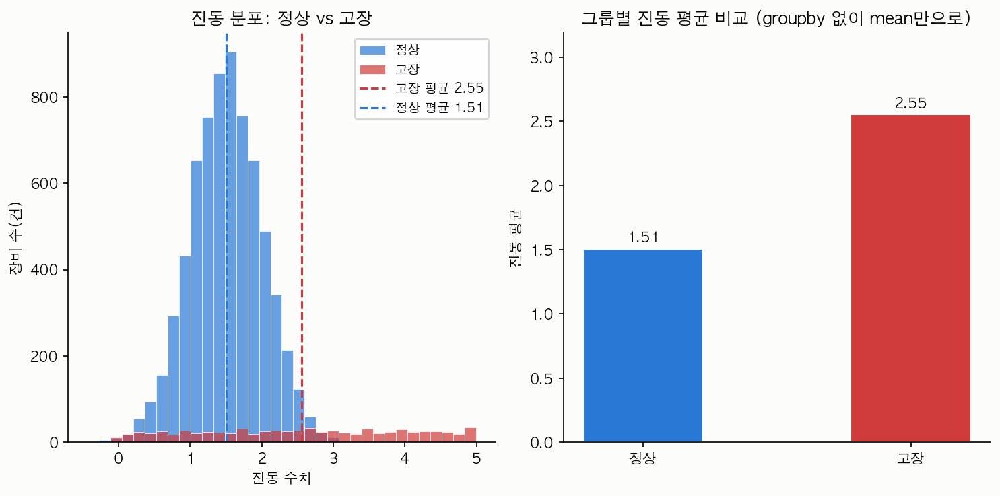
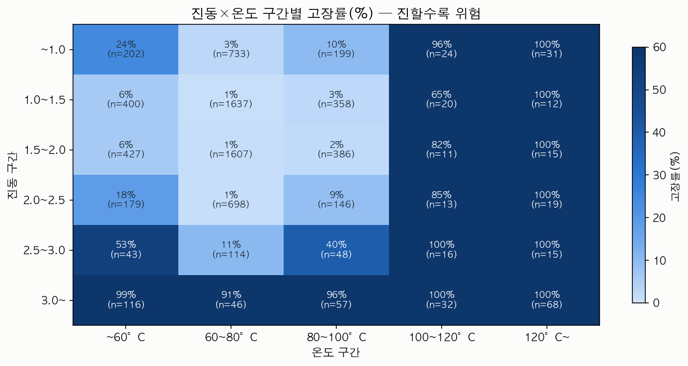
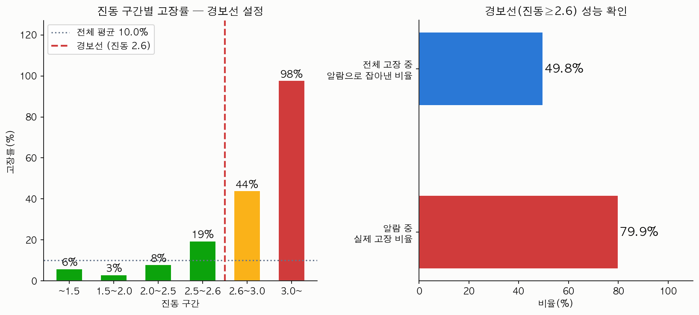

# ⚙️ Equipment Sensor Analysis — ML 없이 groupby로 하는 이상탐지

## 개요 (Overview)

제조 설비 센서 데이터 7,672건으로 "고장 나기 전에 미리 알 수 있는가"에 답하는 경량 분석입니다. 분류 모델도, 이상탐지 알고리즘도 쓰지 않습니다. `mean()`으로 그룹 평균을 비교하고, `groupby`로 구간별 고장률을 세고, 임계값 하나로 그은 경보선의 정밀도·재현율을 계산하는 것이 전부입니다.

핵심 결과: 진동 센서값이 **2.6 이상**이면 경보를 울리는 규칙 하나만으로 알람 중 **79.9%**가 실제 고장이었습니다 (정밀도). 모델 학습 없이, if문 수준의 규칙으로 이 정도 신호를 잡아낼 수 있다는 점이 이 레시피의 셀링 포인트입니다.

## 데이터 출처 (Data Source)

- **원본**: Kaggle — [Industrial Equipment Monitoring Dataset](https://www.kaggle.com/datasets/dnkumars/industrial-equipment-monitoring-dataset) (Dinesh Naveen Kumar Samudrala, Apache 2.0)
- 터빈·컴프레서·펌프의 실시간 모니터링을 시뮬레이션한 합성(synthetic) 데이터셋. 온도·압력·진동·습도·장비유형·위치·고장여부 7개 컬럼, 7,672행.
- 이 레포에는 `data/equipment_anomaly_data.csv`로 원본 그대로(가공 없이) 포함되어 있습니다 (720KB, 1MB 미만이라 샘플링 없이 전체 커밋).
- **재현 방법**: 위 Kaggle 링크에서 원본을 내려받아 같은 파일명으로 `data/`에 넣으면 동일한 결과가 나옵니다.

## 기술 스택 (Stack)

- Python 3.13
- pandas 2.2 — `groupby`, `pd.cut`, `mean()`만 사용 (모델링 없음)
- matplotlib 3.10 — 히스토그램·막대그래프·히트맵
- uv — 가상환경·패키지 관리

## 실행 방법 (How to Run)

```bash
uv venv .venv && source .venv/bin/activate
uv pip install -r requirements.txt
python analysis.py
```

실행하면 `assets/`에 PNG 차트 3장이 생성됩니다 (콘솔에도 수치 요약이 출력됩니다).

## 분석 단계 (Steps)

### 1. 정상 vs 고장 그룹 평균 비교 — `groupby` 없이 `mean()`만으로

```python
normal_df = df[df['faulty'] == 0]
fault_df  = df[df['faulty'] == 1]

for col in ['temperature', 'pressure', 'vibration', 'humidity']:
    print(fault_df[col].mean() - normal_df[col].mean())
```

가장 단순한 비교부터 시작합니다. 진동 평균 차이(+1.05)가 온도(+9.95)·압력(+7.00)보다 절대값은 작아 보이지만, 아래 3단계에서 확인하듯 실제로 고장을 가장 잘 가르는 축은 진동입니다.

### 2. 진동×온도 교호작용 — 2차원 `groupby`

```python
df['vib_bin']  = pd.cut(df['vibration'], bins=vib_bins, labels=vib_labels)
df['temp_bin'] = pd.cut(df['temperature'], bins=temp_bins, labels=temp_labels)

pivot = df.groupby(['vib_bin', 'temp_bin'], observed=True).agg(
    total=('faulty', 'count'), faults=('faulty', 'sum')
).reset_index()
pivot['rate'] = pivot['faults'] / pivot['total'] * 100
```

두 변수를 동시에 구간화(`pd.cut`)하고 `groupby`로 셀별 고장률을 계산합니다. 통계 모델 없이 표만으로 "진동과 온도가 같이 높을 때 위험이 커지는가"를 확인할 수 있습니다.

### 3. 경보선 하나로 정밀도·재현율 계산

```python
THRESHOLD = 2.6
alarm_df = df[df['vibration'] >= THRESHOLD]
precision = alarm_df['faulty'].sum() / len(alarm_df) * 100   # 알람 중 실제 고장 비율
recall    = alarm_df['faulty'].sum() / df['faulty'].sum() * 100  # 전체 고장 중 알람이 잡아낸 비율
```

머신러닝의 정밀도(precision)·재현율(recall) 개념을 분류 모델 없이도 계산할 수 있습니다. 임계값 하나를 조건문으로 걸었을 뿐인데 두 지표가 바로 나옵니다.

## 결과 (Results)

### 1. 진동 분포 — 정상 vs 고장



정상 그룹은 진동 1.5 부근에 뾰족하게 몰려 있고, 고장 그룹은 넓게 퍼지며 평균이 2.55로 확연히 오른쪽에 있습니다. 두 그룹 평균 차이가 1.05로, 네 센서 중 상대적으로 가장 뚜렷한 분리를 보입니다.

### 2. 진동×온도 구간별 고장률 히트맵



진동이 낮아도(1.0~2.5) 온도가 100°C를 넘으면 고장률이 65~100%로 치솟습니다. 반대로 온도가 낮아도(~100°C) 진동이 3.0을 넘으면 고장률이 91~99%까지 올라갑니다. 즉 "둘 중 하나만 봐도 위험 신호"이지만, 표본 수(n)가 극단 구간에서는 작다는 점은 감안해야 합니다.

### 3. 경보선(진동 ≥ 2.6) 성능



진동 구간별 고장률은 임계값을 넘는 순간 계단식으로 뛰어오릅니다(2.5~2.6구간 19% → 2.6~3.0구간 44%). 이 지점을 경보선으로 잡으면:

- **정밀도 79.9%** — 알람이 울린 478건 중 382건이 실제 고장
- **재현율 49.8%** — 전체 고장 767건 중 절반 가까이를 이 규칙 하나로 잡아냄

## 해석 포인트 (Interpretation)

- **"이상탐지 = 모델링"이 아니다.** 임계값 하나(진동 ≥ 2.6)로도 실무에서 쓸 만한 정밀도(79.9%)가 나옵니다. 재현율이 49.8%로 절반의 고장을 놓치는 건 한계지만, "일단 경보 시스템을 켜고 시작"하기엔 충분한 출발점입니다.
- **교호작용은 groupby 두 번으로 확인 가능.** 진동과 온도를 각각 따로 볼 때보다, 두 축을 동시에 구간화한 히트맵에서 위험 패턴이 더 선명하게 드러납니다.
- **정밀도·재현율 트레이드오프가 규칙 기반에서도 그대로 나타난다.** 임계값을 낮추면 재현율은 오르고 정밀도는 떨어집니다 — 모델이 없어도 이 트레이드오프 자체는 존재합니다.

## 한계와 확장 아이디어 (Limitations & Extensions)

- **단일 변수 임계값의 한계**: 진동 하나만 보므로 온도가 높지만 진동이 낮은 고장(히트맵의 100~120°C, ~60°C 구간 등)은 놓칩니다. 다변량 규칙(예: 진동 OR 온도 조건 결합)으로 재현율을 끌어올릴 여지가 있습니다.
- **합성 데이터의 한계**: Kaggle 원본이 시뮬레이션 데이터이므로, 실제 설비에서는 센서 노이즈·설치 편차로 임계값이 달라질 수 있습니다.
- **ML로 확장한다면**: 로지스틱 회귀나 랜덤포레스트로 다변량 임계값을 자동 학습시키면 재현율을 끌어올릴 수 있습니다. 다만 이 레시피의 의도는 "모델 없이 어디까지 되는가"를 먼저 확인하는 것이므로, ML은 이 baseline이 부족할 때 넘어가는 다음 단계로 남겨둡니다.
- **건설장비 예지보전(Mission A)**: 같은 원저장소(equipment-analysis)에는 부품 잔존수명(RUL)을 다루는 두 번째 미션이 있습니다 — 가동시간·진동 복합조건으로 "지금 당장 점검 필요" 부품을 골라내는 분석입니다. 이 레시피는 이상탐지(Mission B)만 다루므로, 예지보전 패턴이 필요하면 참조 링크의 풀버전에서 확인할 수 있습니다.

## 참조 (References)

- 풀버전(두 미션 + 정적 사이트): https://ggplab.github.io/equipment-analysis/
- 원본 데이터: [Industrial Equipment Monitoring Dataset (Kaggle)](https://www.kaggle.com/datasets/dnkumars/industrial-equipment-monitoring-dataset)

---
© 2026 BuildnWrite. All rights reserved.
