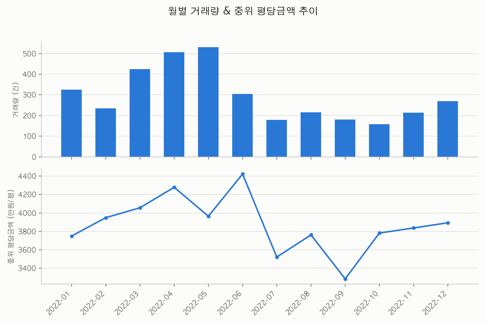
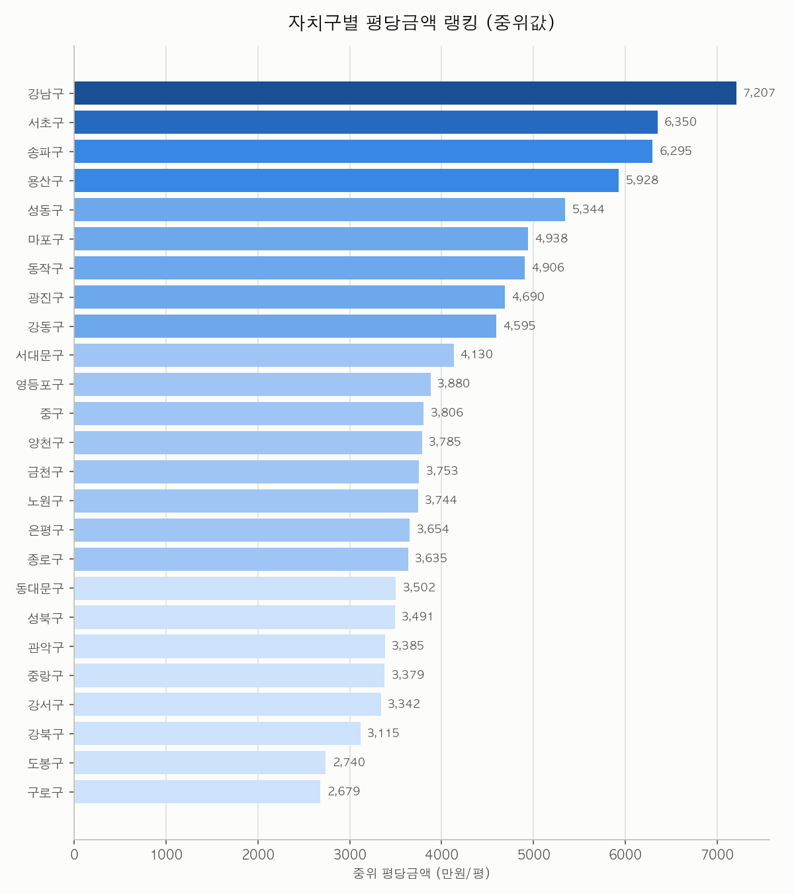
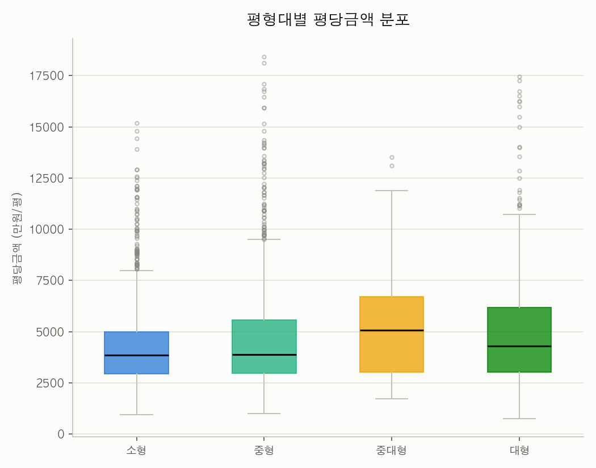
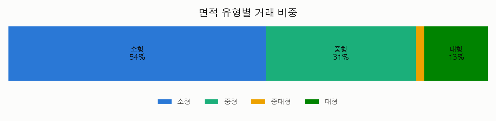

# 🏠 Seoul Apartment Trends — 내 집 마련 전에 데이터부터

## 개요 (Overview)

"내 집 마련을 준비 중인 30대 직장인이 관심 동네의 실거래가 추이를 직접 확인하고 싶다" — 이 페르소나 하나로 시작하는 분석입니다. 국토교통부 아파트 매매 실거래가 API에서 서울 25개 자치구 데이터를 받아, 월별 시장 흐름·자치구별 평당가·평형대별 가격 분포까지 4장의 차트로 답합니다.

핵심 전처리는 딱 네 단계입니다: 전용면적(㎡) → 평 환산, 평형대 분류(소형/중형/중대형/대형), 계약년월+계약일 → 날짜, 거래금액 ÷ 평 = 평당금액. 이 레시피는 2022년 실거래 12,651건 중 자치구별 비례 층화추출로 뽑은 3,543건 샘플로 재현하며, 전체 데이터는 `fetch_data.py`로 직접 받을 수 있습니다.

## 데이터 출처 (Data Source)

- **원본**: [국토교통부 아파트 매매 실거래가 상세 자료](https://www.data.go.kr/data/15126469/openapi.do) (공공데이터포털 공개 API, `getRTMSDataSvcAptTradeDev`)
- 이 레포에는 `data/sample_apt_trades.csv`로 자치구별 비례 층화추출 샘플(3,543건, 242KB, 2022년 1~12월)이 포함되어 있습니다 — 원본 실거래 CSV에서 조작·가공 없이 실제 값만 추출했습니다.
- **API 키 발급 절차**:
  1. https://www.data.go.kr/data/15126469/openapi.do 접속 → 우측 상단 "활용신청" 클릭
  2. 활용 목적 작성 후 제출 (승인까지 보통 몇 분~몇 시간)
  3. 마이페이지 > 개발계정에서 "일반 인증키 (Decoding)" 복사
- **재현 방법(전체 데이터)**:
  ```bash
  export MOLIT_API_KEY="<발급받은 서비스키>"
  python fetch_data.py 2024              # 2024년 서울 25개 구 전체 (최대 300회 API 호출)
  python fetch_data.py 2024 --gu 강남구    # 특정 구만 빠르게 테스트
  ```
  API 키가 없어도 번들 샘플로 `python analysis.py`는 바로 실행됩니다.

## 기술 스택 (Stack)

- Python 3.13
- pandas 2.2.3 — 전처리·`groupby` 집계
- matplotlib 3.9.2 — 막대·선·박스플롯·누적막대
- requests 2.32.3 — 공공데이터포털 API 호출 (`fetch_data.py`)
- uv — 가상환경·패키지 관리

## 실행 방법 (How to Run)

```bash
uv venv .venv && source .venv/bin/activate
uv pip install -r requirements.txt
python fetch_data.py 2024   # 선택: API 키로 전체 데이터 갱신 (없으면 번들 샘플 사용)
python analysis.py
```

실행하면 `assets/`에 PNG 차트 4장이 생성됩니다 (콘솔에도 핵심 통계가 출력됩니다).

## 분석 단계 (Steps)

### 1. 전처리 — 평 환산·평형대 분류·날짜 변환·평당금액

```python
df["평"] = (df["전용면적(㎡)"].astype(float) / 3.3).round(2)
df["유형"] = df["전용면적(㎡)"].astype(float).apply(category)  # 소형/중형/중대형/대형
df["계약일자"] = pd.to_datetime(df["계약년월"] + df["계약일"].str.zfill(2), format="%Y%m%d")
df["평당금액"] = (df["거래금액(만원)"].astype(float) / df["평"]).round(2)
```

국토부 실거래 API가 주는 원시 필드(㎡, YYYYMM+DD, 만원)를 사람이 바로 읽을 수 있는 지표(평, 날짜, 평당금액)로 바꾸는 단계입니다. 이후 모든 분석은 이 4개 파생 컬럼 위에서 돌아갑니다.

### 2. 월별 거래량 & 중위 평당금액 추이

```python
monthly = df.groupby(df["계약일자"].dt.to_period("M")).agg(
    거래량=("평당금액", "size"), 중위평당금액=("평당금액", "median")
)
```

거래량(건수)과 평당금액(가격)은 스케일이 다른 지표라 한 축에 억지로 같이 그리지 않고, 위아래 2단 패널로 분리했습니다.

### 3. 자치구별 평당금액 랭킹

```python
ranked = df.groupby("구")["평당금액"].median().sort_values(ascending=True)
```

평균이 아니라 **중위값**을 씁니다 — 초고가 거래 한두 건에 자치구 순위가 흔들리지 않도록 하기 위함입니다.

### 4. 평형대별 가격 분포 & 거래 비중

```python
data = [df.loc[df["유형"] == t, "평당금액"].values for t in ["소형", "중형", "중대형", "대형"]]
```

박스플롯으로 평형대별 평당금액의 중앙값·사분위·이상치를 한눈에 비교하고, 100% 누적 막대로 어떤 평형대가 실제로 가장 많이 거래되는지 비중을 보여줍니다.

## 결과 (Results)

### 1. 월별 거래량 & 중위 평당금액 추이



4~6월 거래량이 반짝 늘었다가 하반기 내내 100~300건대로 가라앉습니다. 평당금액은 6월에 정점(4,420만원)을 찍고 9월에 저점(3,290만원)을 찍는데, 이는 표본 특성상 시기별 거래 구성(어느 구·어느 평형이 그 달에 많이 거래됐는지)의 영향을 받은 값이라 "시장이 9월에 30% 하락했다"는 뜻은 아닙니다.

### 2. 자치구별 평당금액 랭킹



강남구(7,207만원)가 1위, 구로구(2,679만원)가 25위로 **약 2.7배 격차**입니다. 강남 3구(강남·서초·송파)와 용산구가 뚜렷하게 상위 그룹을 이루고, 이후로는 완만한 경사로 이어집니다.

### 3. 평형대별 평당금액 분포



중대형(85~102㎡)의 중위 평당금액이 가장 높고, 소형·중형·대형은 중위값 자체는 비슷하지만 소형·중형 쪽에 고가 이상치(위쪽 점들)가 더 많이 몰려 있습니다 — 소형 평형에도 초고가 거래(재건축 단지 등)가 섞여 있다는 뜻입니다.

### 4. 면적 유형별 거래 비중



전체 거래의 **54%가 소형(60㎡ 이하)**입니다. 중형(31%)까지 합치면 85%가 소형·중형에 몰려 있고, 중대형·대형은 합쳐서 15%뿐 — "서울 아파트 거래의 주력은 소형·중형"이라는 걸 숫자로 보여줍니다.

## 해석 포인트 (Interpretation)

- **평균이 아니라 중위값을 봐야 하는 이유가 랭킹 차트에 그대로 드러납니다.** 자치구 하나에 20억짜리 거래 몇 건만 있어도 평균은 크게 흔들리지만, 중위값은 "그 동네 보통의 거래가"를 더 안정적으로 보여줍니다.
- **거래량과 가격은 같이 움직이지 않을 수 있습니다.** 월별 추이 차트에서 거래량이 줄어드는 하반기에도 평당금액이 반드시 같이 내려가지는 않았습니다 — 거래 건수 자체가 적을 때는 중위값이 그 달의 표본 구성에 더 민감해집니다.
- **평형대별 분포는 "평균 가격"만으로는 안 보이는 이상치 구조를 드러냅니다.** 소형 평형의 상단 이상치가 많다는 것은 "소형=저가"라는 통념이 항상 맞지는 않는다는 신호입니다.

## 한계와 확장 아이디어 (Limitations & Extensions)

- **샘플 데이터의 한계**: 이 레포의 샘플은 2022년 한 해, 자치구별 28% 층화추출본입니다. 월별 추이처럼 표본 수가 작아지는 분석(특정 월 x 특정 구)은 전체 데이터(`fetch_data.py`로 재현)로 다시 확인하는 것을 권장합니다.
- **동 단위 분석은 다루지 않음**: 원본 대시보드는 동별 랭킹·최고가 TOP 10까지 보여주지만, 이 레시피는 "30분 안에 재현 가능한 핵심"에 집중하기 위해 구 단위까지만 다룹니다. 동 단위가 필요하면 `analysis.py`의 `groupby("구")`를 `groupby(["구", "동"])`로 바꾸면 됩니다.
- **최근 시장과 비교하려면**: 국토부 실거래가 공개시스템(rt.molit.go.kr)에서 최근 1년 CSV를 받아 같은 전처리를 적용하면 2022년 수업 데이터와 현재 시장을 나란히 비교할 수 있습니다.
- **다음 단계**: 계절성 분해(STL), 자치구 간 가격 수렴/발산 추이, 건축년도(재건축 연한) 대비 가격 프리미엄 분석으로 확장 가능합니다.

## 참조 (References)

- 풀버전(인터랙티브 대시보드 — 구/동/면적유형 필터, 2022년 ↔ 최근 1년 토글): https://ggplab.github.io/seoul-apt-trends
- 원본 API: [국토교통부 아파트 매매 실거래가 상세 자료 (공공데이터포털)](https://www.data.go.kr/data/15126469/openapi.do)
- 실거래가 공개시스템(키 불필요 CSV 다운로드): https://rt.molit.go.kr/pt/xls/xls.do

---
© 2026 BuildnWrite. All rights reserved.
