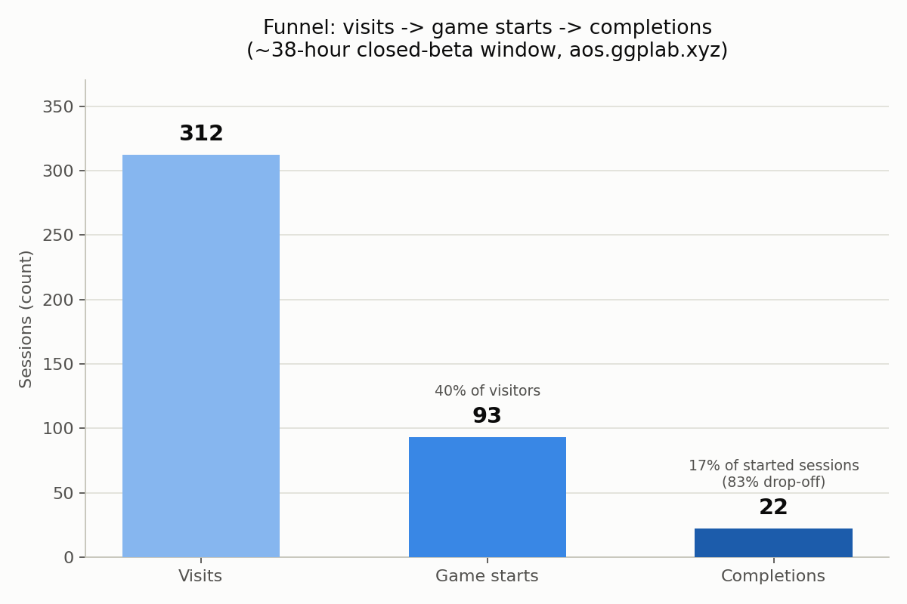
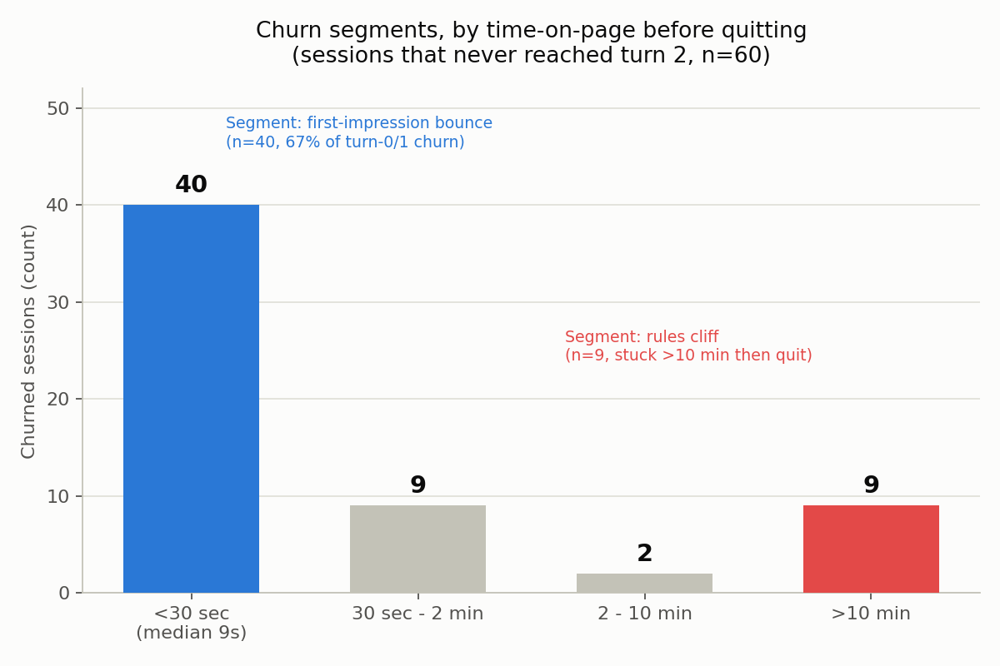

# 🚂 Board Game Web App — Closed-Beta Funnel & Churn Analysis

## Context

A solo developer ported a genuinely complex board game (an Age of Steam-style
18xx/train-building strategy game — auction economy, track building, goods
delivery) to the web, playable against an AI opponent, live at
[aos.ggplab.xyz](https://aos.ggplab.xyz). It shipped to a closed beta: a small
group of invited players, no paid acquisition, no press. The question this
analysis answers is the one every solo builder asks after the first invite
links go out: **of the people who showed up, how far did they get, and where
exactly did they fall off?**

The data below covers a single **~38-hour window** right after launch
(2026-07-04 23:06 UTC through 2026-07-06 13:03 UTC). This is small-sample,
directional analysis, not a statistically powered study — see
[Limitations](#limitations-honest-version) before drawing hard conclusions.

## What We Instrumented

No Google Analytics, no third-party SDK, no cookies. The app already had a
tiny Express backend for its AI opponent, so telemetry piggybacked on that:
a client-generated anonymous ID in `localStorage`, a handful of named events
(`visit`, `gameStart`, `turnStart`, `sessionEnd`/`gameOver`), and an
append-only JSONL log file read back through a small aggregation endpoint.

Full build-it-yourself writeup, event schema, and the pros/cons of this
approach vs. a real analytics stack: **[instrumentation.md](instrumentation.md)**.

## The Funnel

| Stage | Count (sessions / unique) | Conversion |
|---|---|---|
| Visits | 312 / 149 unique | — |
| Game starts | 93 / 59 unique | 40% of visitors |
| Completions | 22 / 11 unique | 17% of started sessions (83% drop-off) |
| Repeat visits (2+) | 29 / 149 unique | 19% |
| Replays (2+ games) | 10 / 59 unique | 17% |

Daily visits were still climbing inside the window (98 on day one → 214 on
day two), so this is a launch curve caught mid-ramp, not a steady state.

The single biggest cliff isn't "starting a game" — 40% of visitors do that,
which is a respectable rate for a cold invite link into a genre this niche.
The cliff is **after** the game starts: 83% of started sessions never finish.
That's where the churn-segmentation work below is aimed.

## Churn Segmentation

Looking at "83% drop-off" as one number hides two very different failure
modes. Of 77 total churned sessions in the window, **60 (78%) never got
past the very first turn**, and another 13 stalled out at turn 2 — so the
large majority of the damage happens at the very start of the game. The
separating variable for the 60 first-turn dropouts turned out to be
**time-on-page before quitting**, and it split those sessions into a clearly
bimodal shape rather than one smooth curve:

| Time on page before quitting | Sessions |
|---|---|
| Under 30 seconds (median 9 seconds) | 40 |
| 30 seconds – 2 minutes | 9 |
| 2 – 10 minutes | 2 |
| Over 10 minutes | 9 |

That shape is two different stories, not one:

- **"First-impression bounce" (n=40, median 9 seconds).** These sessions
  leave almost the instant the board renders. This isn't a rules
  comprehension problem — nobody reads and rejects a rulebook in 9 seconds.
  It reads as a missing "what do I do right now" affordance: the board loads
  and nothing tells a new visitor what the first legal action is.
- **"Rules cliff" (n=9, over 10 minutes).** These sessions sit with the game
  for ten-plus minutes — long enough to be genuinely trying to understand
  it — and still can't get past turn 1. The likely cause: the first turn
  bundles three unfamiliar mechanics at once (auction, track-building, goods
  movement) with no scaffolding between them.

The two groups sit at opposite ends of the same "quit on turn 1" bucket, but
they call for opposite fixes — an affordance fix for the bounce group, a
guided-onboarding fix for the cliff group — which is exactly why collapsing
them into one "83% drop-off" number would have pointed the roadmap at the
wrong problem.

## The Difficulty Finding (Counterintuitive)

The intuitive assumption going in was that "easy" difficulty protects new
players. The data says the opposite:

- Of 20 completed games, 6 ended in a human bankruptcy (rank 0) — **all 6
  were on easy difficulty.**
- Easy-difficulty games actually had a *higher* drop-off rate than normal
  (89% vs. 82%).

The likely mechanism: "easy" mode only weakens the AI opponent. It does
nothing about the actual cause of beginner bankruptcy — stock-issue and
operating-cost mechanics that a new player doesn't yet understand. A weaker
AI doesn't stop a beginner from making a fatal economic mistake on turn 3;
it just removes the one thing ("harder AI") that difficulty setting was
supposed to change. Easy mode had no beginner-protection mechanism at all.

Two smaller signals from the same completed-games data, carried into the
fix list below:

- Players who *do* survive win convincingly (65% human win rate, average VP
  margin +48.3 over the best AI) and the AI goes bankrupt in 60% of
  completed games — suggesting the AI is undertuned for players who make it
  past the early-game cliff, which may be capping the 17% replay rate.
- One bug report flagged AI behavior on a 2-player map variant, with a
  reproducible random seed attached — a small, concrete, independently
  fixable item.

## Decisions Taken

Prioritized by the segment/finding driving them:

| # | Fix | Driven by | Expected effect |
|---|---|---|---|
| 1 | First-turn guide overlay — highlight the 3-step sequence (auction → build → move goods) with a pulsing indicator on the current legal action | First-impression bounce (n=40) | Cut turn-1 abandonment substantially |
| 2 | Redesign easy difficulty as *beginner protection*, not *weaker AI* — bankruptcy warning UI, a tooltip on stock-issue cost, and (easy-only) one bankruptcy grace period or a starting-cash buffer | Easy-mode bankruptcies (6/6) | Higher easy-mode completion and replay |
| 3 | Scripted interactive tutorial on a fixed seed covering the first two turns | Rules cliff (n=9) | Fewer stuck-then-quit sessions past 10 minutes |
| 4 | Replay and fix the reported 2-player AI bug using the attached seed | Bug report | Fixed defect + rebuilt trust |
| 5 | Continue AI-strength tuning, with more opponent diversity in the pre-release evaluation gate | Weak-AI signal | Better retention for players who clear the early game |
| 6 | Lightweight return hook for the 11 players who did finish a game (e.g., a shared daily-seed challenge) | 19% repeat-visit rate | More reasons to come back |

## How Each Fix Will Be Validated

Every fix has a pre-committed metric and a numeric target from the same
telemetry pipeline, checked after deploy — not a subjective "does it feel
better":

- **#1 and #3** — telemetry `turnStart` event, "reached turn 2" rate,
  before vs. after (baseline: 22% of started sessions reach turn 2).
- **#2** — bankruptcy rate among human players in completed easy-mode games
  (baseline: 100%, target: under 30%).
- **#4** — replay the flagged seed, confirm the anomalous move disappears
  after the fix.
- **#5** — whether the updated AI clears the internal evaluation gate
  against a frozen production baseline (it did not on the first attempt,
  which is why this fix stayed in the pipeline rather than shipping).

## Limitations (Honest Version)

- **This is 38 hours of data from a closed beta, not a general-audience
  launch.** 149 unique visitors and 11 completions is directional signal,
  not a statistically significant sample — no confidence intervals are
  reported here because they'd be misleadingly precise at this N.
- **One visitor accounted for 103 of the 312 visits** and is presumed to be
  the developer testing the deployment, not a real user. The rates above are
  reported as they are in the source data; treat them as slightly optimistic
  rather than re-deriving a "corrected" number from a guess about who that
  visitor was.
- **The two churn segments are separated by a behavioral proxy (time on
  page), not a stated reason.** Nobody was surveyed on *why* they left; the
  9-second-vs-10-minute split is an inference from session shape, which is
  a reasonable read but not a confirmed causal story.
- **No A/B test underlies the fix list.** These are prioritized hypotheses
  from one snapshot of behavior, to be confirmed or falsified against the
  next telemetry window after each fix ships — that's what the validation
  section above is for.

## References

- Live app: [aos.ggplab.xyz](https://aos.ggplab.xyz)
- Instrumentation deep-dive: [instrumentation.md](instrumentation.md)
- Chart source: [generate_charts.py](generate_charts.py) — regenerates both
  PNGs in `assets/` from the aggregate numbers in this README, no raw logs
  involved.

---
© 2026 BuildnWrite. All rights reserved.
