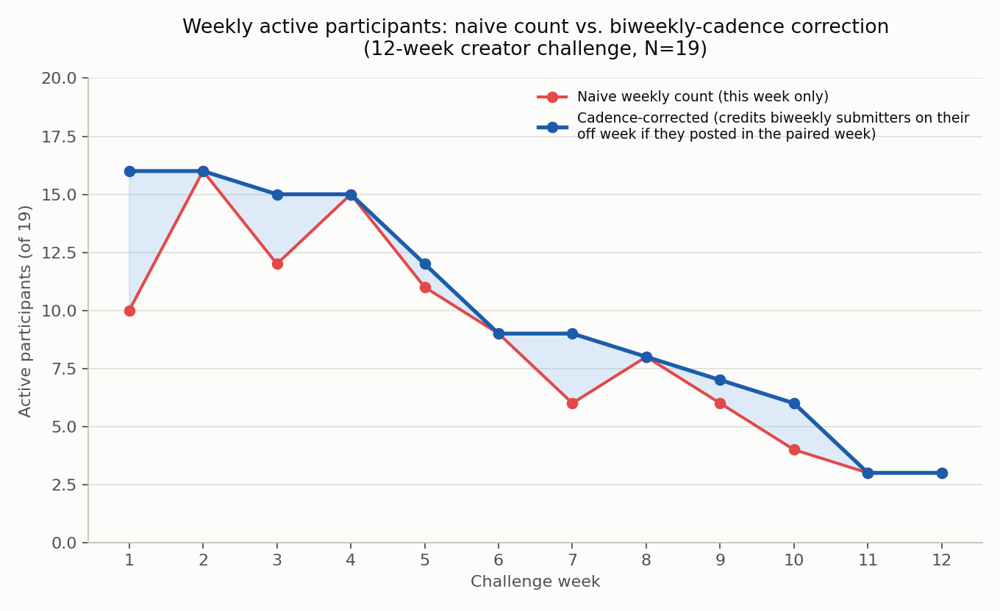
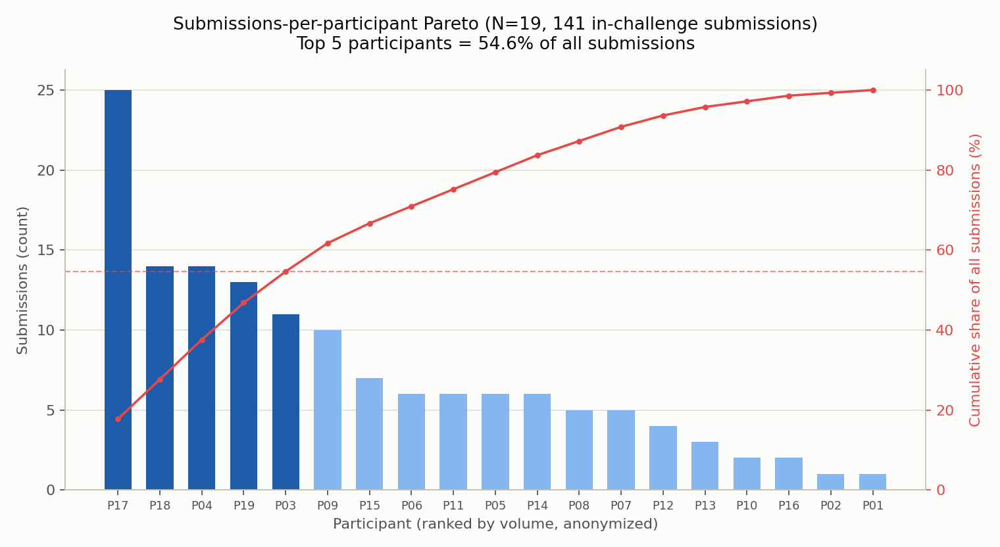
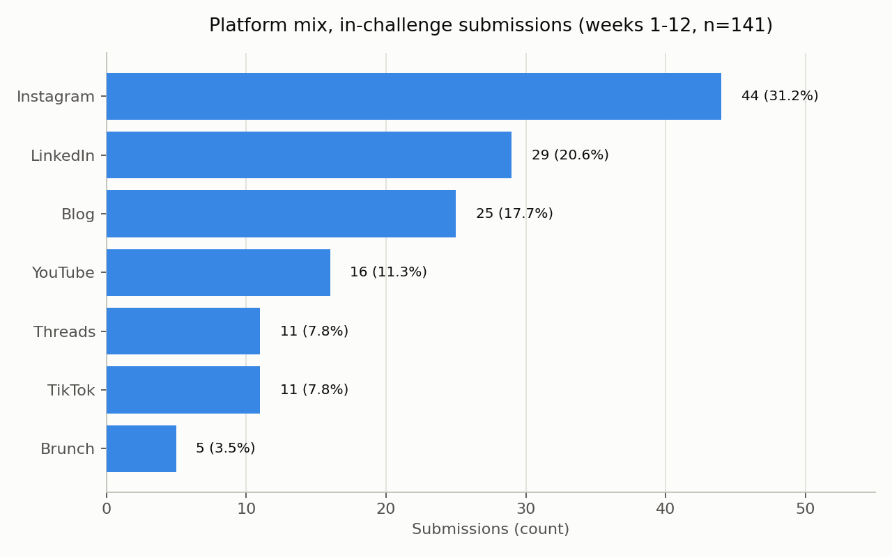

# 🏁 Challenge Community — Completion Curves and the Biweekly-Cadence Trap

## Context

A 19-person cohort ran a **12-week content-creation challenge** organized
inside a Discord community. Anyone could post to any platform they liked
(blog, LinkedIn, Instagram, YouTube, Threads, TikTok, Brunch); a Discord bot
took a `/submit`-style command, verified the link, and logged one row per
submission to a shared sheet. The only participation rule was a minimum
posting cadence: **most participants committed to weekly**, but a sizeable
minority (9 of 19) opted into a **biweekly** cadence up front.

That two-speed design is exactly what makes this dataset useful as a case
study: it's a small, realistic trap that shows up anywhere a community allows
more than one legitimate cadence — a naive "how many people posted *this*
week" count will read half the community as churned every other week, when
they're actually right on schedule.

The organizer is one of the 19 participants and is anonymized the same way as
everyone else — this write-up has no privileged narrator.

## Data

- **Source**: a public Google Sheet, fetched read-only via the `gviz` JSON
  endpoint (one row per verified submission: date, participant, platform,
  a free-text week label such as "week 3, submission 2" or "prep period",
  and a visibility flag).
- **Window**: a 1-week prep period, then 12 challenge weeks
  (`2026-03-02` → `2026-05-23`); one late/bonus post landed 2 days after the
  official end and is excluded from all "in-challenge" metrics below.
- **N**: 20 people signed up; 19 actually submitted at least once (the
  20th never posted and is excluded from every denominator here — see
  [Limitations](#limitations)).
- **Reproduction path**: `python analysis.py` fetches the live sheet and
  regenerates `data/submissions_anonymized.csv`; `python analysis.py --cached`
  skips the network call and reads that committed CSV instead. Both paths
  produce identical numbers (verified below).

### Anonymization

Every participant is a code, **P01–P19**, assigned by a one-way hash of their
canonical identity (folding Discord-nickname aliases into one person first).
`data/submissions_anonymized.csv` carries only `p_code, date, week_index,
platform, visibility` — no names, no nicknames, no links, no post summaries.
`analysis.py` never contains a table that reverses P-code back to an
identity; see the docstring at the top of that file for exactly how the hash
map works and why.

## Stack

Python (standard library + `matplotlib` only — no `pandas`, no `requests`;
the sheet is small enough that `csv`/`urllib` cover it).

## How to Run

```bash
cd case-studies/challenge-community
uv venv .venv && source .venv/bin/activate
uv pip install -r requirements.txt
python analysis.py              # tries the live sheet, falls back to --cached
# or, to skip the network call entirely:
python analysis.py --cached
```

Both commands print the headline numbers below and (re)write three PNGs to
`assets/`.

## Analysis Steps

1. Fetch the submission log (live) or read the committed anonymized CSV
   (`--cached`).
2. Parse each row's free-text week label ("week N" / "prep period") into a
   `week_index` (`0` = prep period, `1–12` = challenge weeks, `13` = the one
   post-challenge row) — the same parsing rule the project's own live
   dashboard uses.
3. **Naive weekly active participants**: count of unique participants who
   submitted in week *w*, full stop.
4. **Cadence-corrected weekly active participants**: for biweekly
   participants, treat weeks in pairs — `(1,2), (3,4), … (11,12)`. A biweekly
   participant is credited as active in *both* weeks of a pair if they
   submitted in *either* one. Weekly-cadence participants are unaffected
   (their correction is a no-op).
5. Survival/completion rate per week = active participants ÷ 19, computed
   both ways.
6. Pareto: submissions per participant across the 12 in-challenge weeks,
   ranked, top-5 share of total volume.
7. Platform mix: submission counts by platform, in-challenge weeks only.

## Results

### 1. The completion curve — and the trap in counting it naively



| Week | Naive active | Corrected active | Naive survival | Corrected survival |
|---:|---:|---:|---:|---:|
| 1  | 10 | 16 | 52.6% | 84.2% |
| 2  | 16 | 16 | 84.2% | 84.2% |
| 3  | 12 | 15 | 63.2% | 78.9% |
| 4  | 15 | 15 | 78.9% | 78.9% |
| 5  | 11 | 12 | 57.9% | 63.2% |
| 6  |  9 |  9 | 47.4% | 47.4% |
| 7  |  6 |  9 | 31.6% | 47.4% |
| 8  |  8 |  8 | 42.1% | 42.1% |
| 9  |  6 |  7 | 31.6% | 36.8% |
| 10 |  4 |  6 | 21.1% | 31.6% |
| 11 |  3 |  3 | 15.8% | 15.8% |
| 12 |  3 |  3 | 15.8% | 15.8% |

Week 1 is the clearest example of the trap: a naive count says only **10 of
19 (52.6%)** were active — a number that reads like nearly half the cohort
disengaged before the challenge even got going. The corrected count says
**16 of 19 (84.2%)** — because most of the "missing" 6 were biweekly
participants who were never due that week and simply posted in week 2
instead. The same pattern repeats at weeks 3, 7, 9, and 10: every low point
in the naive line is partly a cadence artifact, not partly a dropout event.

The two curves converge on even weeks (2, 4, 6, 8, 12) — exactly where the
biweekly cadence lines up with the weekly one — which is itself a useful
sanity check that the correction is doing what it claims and nothing more.

**What doesn't change with correction**: by week 12, both curves agree —
**3 of 19 (15.8%) survival**. The cadence correction fixes a *mid-challenge*
undercount; it does not rescue the *end-of-challenge* number. Genuine
attrition over 12 weeks is real here, correction or not.

### 2. Submissions-per-participant Pareto concentration



Across 141 in-challenge submissions, the **top 5 participants produced
54.6%** of all volume — more than half the community's total output came
from about a quarter of its people. The distribution has a long tail: the
bottom 2 participants (P01, P02) each posted exactly once across all 12
weeks.

For community design, this is the standard read on Pareto concentration in
small challenge cohorts: the top 5 aren't just "more active," they're doing
enough of the total volume that losing any one of them would visibly dent
the community's aggregate output — which argues for treating high-frequency
posters as a named retention risk, not just a leaderboard curiosity. It also
means aggregate "total submissions" as a headline metric is fragile: it
swings on a handful of people far more than the naive N=19 would suggest.

### 3. Platform mix



| Platform | Submissions | Share |
|---|---:|---:|
| Instagram | 44 | 31.2% |
| LinkedIn | 29 | 20.6% |
| Blog | 25 | 17.7% |
| YouTube | 16 | 11.3% |
| Threads | 11 | 7.8% |
| TikTok | 11 | 7.8% |
| Brunch | 5 | 3.5% |

No platform requirement was enforced beyond "post somewhere," and the mix
that emerged organically skews toward short-form/visual (Instagram) and
professional (LinkedIn) over long-form (Blog, YouTube). Given the platform
choice was entirely self-selected, this mix says more about what this
particular cohort already had accounts on than about which platform is
inherently better for a content challenge.

## Interpretation — What the Organizer Changed

- **Stopped reading the naive weekly-active number as a churn alarm.** Once
  the biweekly cadence was accounted for, several apparent "bad weeks" (1, 3,
  7, 9, 10) turned out to be scheduling artifacts, not engagement drops —
  which meant fewer reactive check-in messages sent to people who weren't
  actually behind.
- **Treated the top-5 concentration as a retention-risk list, not a
  leaderboard.** With just over half of total output coming from 5 of 19
  people, those 5 became the ones worth a direct, individual check-in if
  *they* went quiet — losing one of them moves the aggregate numbers more
  than losing any of the bottom 10 combined.
- **Left the platform choice unconstrained.** The organic mix (Instagram +
  LinkedIn ≈ 52% of volume) matched what the cohort already used day to day;
  nothing in this data argued for mandating a specific platform.
- **Accepted the week-12 number as a real finding, not a modeling artifact.**
  15.8% survival at week 12 holds under both the naive and corrected method
  — the honest takeaway from a 12-week, opt-in, no-penalty challenge is that
  most drop-off is real and cadence-correction doesn't explain it away.

## Limitations

- **N=19.** Every percentage above is a fraction of 19 people. A single
  participant moving between "active" and "inactive" swings the weekly rate
  by ~5 points — treat every number here as directional, not statistically
  powered.
- **Self-selected cohort, single cohort.** These are people who opted into a
  content challenge and chose their own cadence commitment up front. Nothing
  here generalizes to a mandatory or paid engagement program, or to a second
  cohort of this same challenge.
- **One registered participant never posted at all** and is excluded from
  every denominator (N=19, not N=20). If that person is counted as a
  week-1 non-starter instead, every "active" percentage above would read
  slightly lower.
- **Cadence correction assumes good faith, not a hard rule.** The
  correction credits a biweekly participant's "off" week if they posted in
  the *paired* week — it does not (and can't, from this log alone) confirm
  the participant intended that pairing rather than simply catching up late.
- **No causal claims.** Nothing here is an A/B test. "The organizer stopped
  sending reactive check-ins" and "engagement look different" are not linked
  by anything in this dataset — this is a measurement case study, not an
  intervention study.

## References

- Chart + metrics source: [analysis.py](analysis.py) — regenerates all three
  PNGs and every number in this README from the sheet (live) or from
  [data/submissions_anonymized.csv](data/submissions_anonymized.csv)
  (`--cached`).

---
© 2026 BuildnWrite. All rights reserved.
