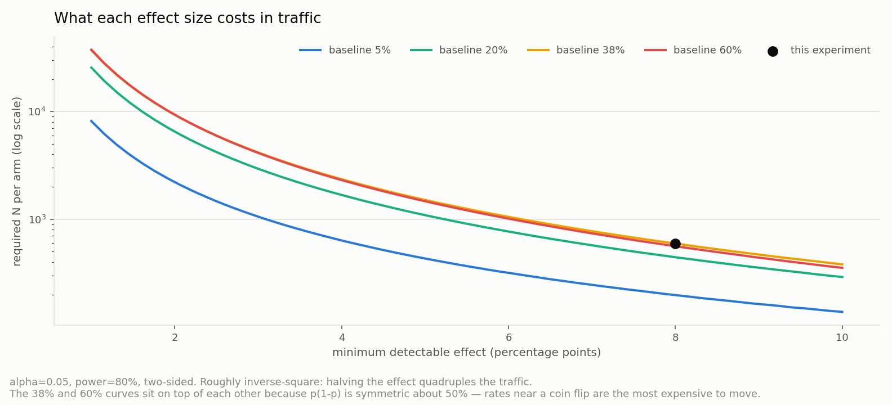
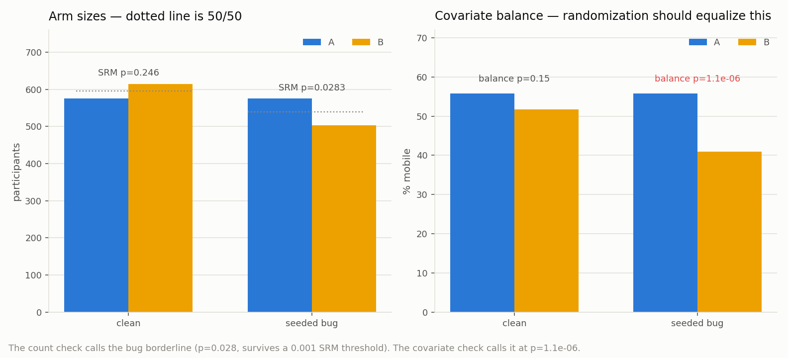
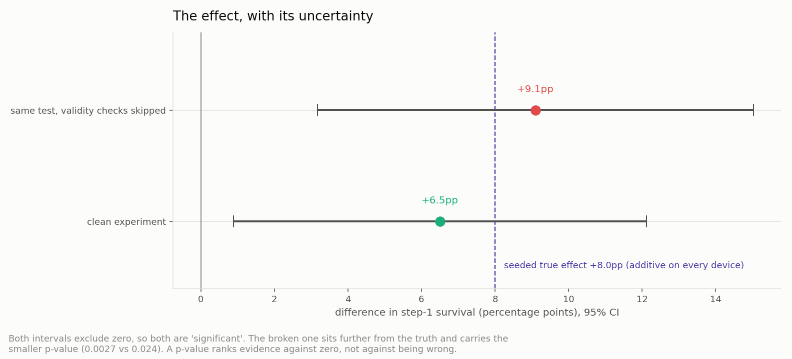
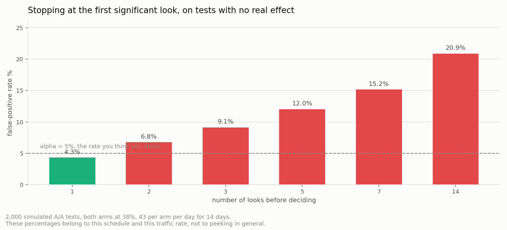

# 🧪 A/B Test Evaluation — The Four Checks Before You Believe a Result

## Overview

The [Weekly Funnel recipe](../funnel-weekly/) ends by admitting it can't prove anything: a before/after comparison across a period where the traffic mix also moved cannot isolate what the change did. This recipe runs the same product's same change as a randomized experiment, and walks the readout in the order it should actually happen.

| Step | The question | What it caught here |
|---|---|---|
| 0 | How much traffic does this need? | 594 per arm required; planned at 600, stopped there |
| 1 | Is the experiment even valid? | A seeded bug the sample-ratio check nearly missed |
| 2 | How big is the effect, and how sure are we? | +6.5pp, 95% CI [+0.9, +12.1], p = 0.024 |
| 3 | What would checking daily have cost? | The false-positive rate rises from 4.3% to 20.9% |

The two findings worth the read are in steps 1 and 3. Step 1 shows a broken experiment producing a *more* significant result than the clean one, because the bug pushed it in the flattering direction. Step 3 puts a measured number on a warning that usually arrives without one.

### Why bother randomizing at all

Here is what before/after evaluation looks like when someone does it honestly. A solo-built web game shipped seven changes over two months and its author evaluated each one by comparing the seven days before to the seven days after, on the same funnel step:

| Deployment | Before (N · start · step-1 pass) | After | Verdict as recorded |
|---|---|---|---|
| First-run guide + bankruptcy warning | 155 · 36% · 30% | 139 · 27% · 45% | The only clean comparison — same audience throughout |
| Auction-forfeit visibility | 211 · 34% · 32% | 83 · 28% · 48% | Overlaps the window above; can't be separated |
| QoL batch + mobile action panel | 250 · 34% · 34% | 46 · 22% · 50% | **Verdict impossible** — 10 starters after |
| Title/language detection + reskin | 113 · 35% · 70% | 141 · 33% · 80% | **Composition effect exceeds the deployment effect** — step-1 pass ran 96% / 78% / 46% by language |
| Official maps + forfeit button | 27 · 44% · 83% | 44 · 41% · 56% | Direction matches another finding, but **magnitude undetermined at n = 18** |
| Map popup play button | 38 · 34% · 54% | 37 · 62% · 78% | The rise was desktop-only; traced to a new-country cohort, not the fix |
| Hardlock fix + static home | 36 · 42% · 73% | 35 · 74% · 88% | **Attribution impossible** — same cohort influx |

Seven deployments, one usable answer. Nothing here is sloppy work — the analyst names exactly why each verdict fails, and refuses to claim magnitude where the sample won't carry it. That's the ceiling of observational evaluation, and it's the argument for randomizing: not rigor for its own sake, but getting more than one answer out of seven attempts.

## Data

Two CSVs, one row per participant, written by `generate_data.py`:

```
user_id,assigned_at,variant,device,survived_step1
u00001,2025-06-02T04:17:33Z,B,mobile,0
u00002,2025-06-02T05:02:11Z,A,desktop,1
```

- `experiment_clean.csv` — 1,190 participants, assignment working correctly
- `experiment_srm.csv` — the same experiment with a seeded bug: variant B's onboarding ships as a separate JS bundle that fails to load on older mobile browsers, so 35% of mobile users assigned to B never reach step 1 and never fire an assignment event. They are silently missing from the log.

**Assignment happens at signup, not at first visit.** The treatment is the post-signup onboarding, so signups are the only population it can affect. Putting visitors in the denominator would dilute the effect with people who were never exposed to it.

- **Reproducible with a fixed seed**: `numpy.random.default_rng(42)`. Both files come from one draw of participants, so they describe the same people — the broken one just fails to record some of them.
- **Not real business data.** The control rate (blended 38%) is taken from the [Weekly Funnel recipe](../funnel-weekly/)'s pre-ship baseline, and the seeded true effect is a flat +8 percentage points on each device. Because it is additive rather than multiplicative, the population effect is +8.0pp whatever the device mix — which is what the confidence intervals below should be covering. The deployment table above *is* real, and is published aggregate-only.

## Stack

- Python 3.11+ / numpy / scipy / matplotlib
- `uv` (virtual environment and package management)

Statistics come from `scipy.stats` rather than hand-rolled formulas, with one exception: the two-proportion z-test is written out so you can read it, and then asserted equal to `scipy.stats.chi2_contingency` on every call (`cross_check()`). For a 2×2 table without continuity correction the chi-square statistic equals z², so if the two ever disagree the run fails loudly instead of printing a plausible wrong number.

## Getting Started

```bash
uv venv .venv && source .venv/bin/activate
uv pip install -r requirements.txt
python generate_data.py   # writes data/experiment_clean.csv + data/experiment_srm.csv
python analysis.py        # writes 4 PNGs to assets/ + prints every table to the console
```

## Results

### 0. Sample size, decided before the data

```
baseline 38%, MDE +8%pt, alpha 0.05, power 80%  ->  594 per arm
cross-check against theory/04's worked example (5% -> 7%): 2210 per arm, doc says ~2,200
```



| baseline | +1pt | +2pt | +5pt | +8pt |
|---|---|---|---|---|
| 5% | 8,155 | 2,210 | 432 | 197 |
| 20% | 25,580 | 6,507 | 1,091 | 444 |
| 38% | 37,165 | 9,333 | 1,510 | 594 |
| 60% | 37,510 | 9,333 | 1,468 | 562 |

Roughly inverse-square: halving the effect you want to detect quadruples the traffic. The 38% and 60% rows are nearly identical because p(1−p) is symmetric about 50% — rates near a coin flip are the most expensive to move.

This is a pre-launch calculation. Running it after the test is over only tells you why the answer was inconclusive.

The experiment below required 594 per arm, was planned at 600, and random assignment realized 575 and 615. Traffic was cut off at the plan, not when the result started looking good — which is the entire subject of step 3.

### 1. Validity checks, before looking at the metric



```
--- experiment_clean.csv ---
arm sizes         A  575   B  615      SRM p = 0.246     pass
device mix        A 55.8% mobile   B 51.7% mobile     balance p = 0.154   pass

--- experiment_srm.csv ---
arm sizes         A  575   B  503      SRM p = 0.0283    pass at alpha=0.001
device mix        A 55.8% mobile   B 41.0% mobile     balance p = 1.1e-06  FAIL
```

A **sample ratio mismatch** check asks whether the arms came out in the ratio you intended. Teams run it at a strict threshold — 0.001 rather than 0.05 — because it runs on every experiment and a 5% false-alarm rate would make it noise.

And at 0.001, the count check here **passes the broken experiment**. A 575/503 split from an intended 50/50 lands at p = 0.028: suspicious, not damning, and easy to wave through.

The check that catches it is **covariate balance**: randomization should equalize not just arm sizes but everything about the people in them. B's mobile share is 41.0% against A's 55.8%, at p = 1.1×10⁻⁶. That's the bug's fingerprint — it removed mobile users specifically — and it's also why the broken experiment reads high: mobile converts far worse, so dropping mobile users from B flatters B.

Run both. The count check is cheap and catches gross failures; the balance check catches the selective ones, which are the dangerous kind.

### 2. The evaluation, once, at planned N



```
--- experiment_clean.csv ---
A  230/ 575 =  40.0%
B  286/ 615 =  46.5%
difference  +6.5pp   95% CI [+0.9, +12.1]     z = 2.262   p = 0.02367

--- experiment_srm.csv — what you would have reported ---
A  230/ 575 =  40.0%
B  247/ 503 =  49.1%
difference  +9.1pp   95% CI [+3.2, +15.0]     z = 3.003   p = 0.002675
```

The clean run measures +6.5pp against a seeded truth of +8.0pp (additive on every device, so mix-independent), and its interval covers the true value. That gap is ordinary sampling variation, and it's the reason to report the interval rather than the point estimate alone: "+6.5pp" invites a precision the data doesn't have, while "[+0.9, +12.1]" says honestly that the effect could be almost nothing or could be half again as large as measured.

The broken run measures +9.1pp with a *smaller* p-value. A more significant result that is further from the truth. A p-value ranks evidence against zero; it says nothing about whether the comparison was valid to begin with, which is why the validity checks come first and not as a footnote.

### 3. What peeking would have done



```
 looks                 schedule  false-positive rate
     1                   day 14                 4.3%
     2  2 looks, last on day 14                 6.8%
     3  3 looks, last on day 14                 9.1%
     5  5 looks, last on day 14                12.0%
     7  7 looks, last on day 14                15.2%
    14 14 looks, last on day 14                20.9%
```

Every test in this simulation is an **A/A test** — both arms drawn from the same 38%, so there is no effect to find and every "significant" result is a false positive by construction. The rule simulated is the one people actually follow: look, and stop if p < 0.05.

One look at the planned end gives 4.3%. With 2,000 replicates the simulation error on a 5% rate is ±0.5pp, so that is the nominal 5% — the simulation is calibrated, which is what makes the rest of the column trustworthy. Checking daily for two weeks gives 20.9% — roughly one in five changes that do nothing, shipped as wins.

**These numbers belong to this simulation, not to peeking in general.** 2,000 replicates, both arms at 38%, 43 users per arm per day, 14 days, each look at α = 0.05, seed 7. Change the traffic rate, the horizon, or the number of looks and the rate changes. Quoting "peeking makes it 21%" as a general fact would be exactly the error [`theory/07-metric-definitions.md`](../../theory/07-metric-definitions.md) is about.

If you genuinely need to monitor a running test, the fix isn't willpower — it's a method built for repeated looks (sequential testing, always-valid p-values) that adjusts the threshold as you go.

## Interpretation Points — what should you read from this?

<details>
<summary><b>1. Why did the broken experiment look better than the clean one?</b></summary>

`SRM_MOBILE_B_LOSS = 0.35` drops 35% of mobile participants assigned to B. The device rates are `P_CONTROL = {desktop: 0.50, mobile: 0.28}` and `P_TREATMENT = {desktop: 0.58, mobile: 0.36}` — mobile converts about 22 points worse in both arms.

The bug selects on *device*, not on outcome — each participant's `survived_step1` is drawn before the filter runs, and the filter only asks whether they were mobile and whether the bundle failed. So no individual is dropped for having converted or not.

What it does instead is change B's composition. B's mobile share falls from 51.7% to 41.0%, and because mobile converts about 22 points worse, B's measured rate rises from 46.5% to 49.1% without any individual behaving differently. The lift inflates from +6.5pp to +9.1pp and the p-value drops by an order of magnitude.

That is the same mix-shift arithmetic the [Weekly Funnel recipe](../funnel-weekly/) is built around, arriving through a different door. There, the mix moved because a new acquisition channel landed; here, because a bug removed one segment from one arm. Randomization is supposed to make the arms' composition identical — so a validity failure is precisely a failure to do that, and a mix comparison is how you detect one. A bug in assignment or in logging silently un-randomizes the experiment while everything downstream still looks like a clean A/B test.
</details>

<details>
<summary><b>2. Why is the SRM threshold 0.001 instead of 0.05?</b></summary>

Because it runs on every experiment you ever launch. At α = 0.05, one in twenty healthy experiments trips the alarm, the team learns to ignore it, and the check stops working. A strict threshold buys the alarm its credibility.

The cost is power, and this dataset shows it: the count check at 0.001 lets a genuinely broken experiment through. That's not an argument for loosening the threshold — it's an argument for the second check. Covariate balance uses more of the data (who is in each arm, not just how many) and catches the selective failures that a count comparison is blind to.
</details>

<details>
<summary><b>3. The clean result is +6.5pp against a true +8.0pp. Is the test wrong?</b></summary>

No — this is what an 80%-powered test looks like when it works. The experiment was sized to have an 80% chance of detecting a +8pp effect, which also means the point estimate bounces around the truth from run to run, and there was a 20% chance of missing it entirely at this N.

The interval is the honest summary: [+0.9, +12.1] contains the true +8.0. Report that, not the point estimate. And note what "significant" bought here — the interval's lower bound is +0.9pp, so the data is compatible with an effect small enough not to be worth the engineering. Significance answered "probably not zero." It did not answer "worth shipping."
</details>

## Limitations

- **One metric, one test.** Testing several metrics, or several variants, multiplies false positives the same way peeking does, and needs a correction this recipe doesn't cover.
- **Binary outcomes only.** The machinery here is for proportions. Continuous metrics (revenue per user, session length) are usually heavily skewed and need different tools — see [`theory/05-statistics-for-pa.md`](../../theory/05-statistics-for-pa.md).
- **No novelty or primacy effect.** Real experiments often see the treatment effect decay as the novelty wears off; a 14-day window measures whatever mixture of novelty and steady state happens to fall inside it.
- **Covariate balance is checked on one covariate.** Real readouts check several (device, channel, country, tenure), which reintroduces the multiple-comparison problem the first bullet mentions.
- **The peeking simulation assumes independent daily arrivals** at a constant rate. Real traffic has weekday cycles and campaign spikes, which change the shape of the cumulative test statistic over time.

## References

- [Wikipedia — A/B testing](https://en.wikipedia.org/wiki/A/B_testing)
- [Wikipedia — Multiple comparisons problem](https://en.wikipedia.org/wiki/Multiple_comparisons_problem) — the family that peeking and multi-metric testing both belong to
- [Wikipedia — Statistical power](https://en.wikipedia.org/wiki/Power_(statistics)) — what the 80% in the sample-size calculation buys
- [`theory/04-ab-testing.md`](../../theory/04-ab-testing.md) — the concepts this recipe runs, including the sample-size formula it reproduces
- [`theory/05-statistics-for-pa.md`](../../theory/05-statistics-for-pa.md) — chi-square, standard error, and confidence interval mechanics
- [Weekly Funnel recipe](../funnel-weekly/) — the same change evaluated observationally, and why that couldn't settle it

---

**Verification method**: `python generate_data.py && python analysis.py` from a clean `uv venv` on the pinned versions in `requirements.txt`. Every reported z-test is asserted equal to scipy's chi-square on the same table, the sample-size routine is asserted to reproduce theory/04's published ~2,200, and every figure quoted above is copied from that run's console output.

© 2026 BuildnWrite. All rights reserved.
