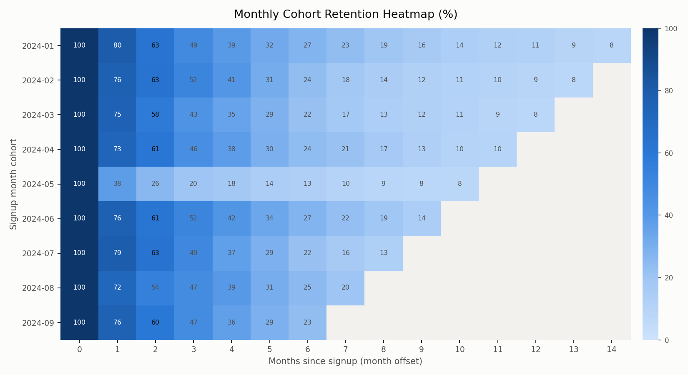
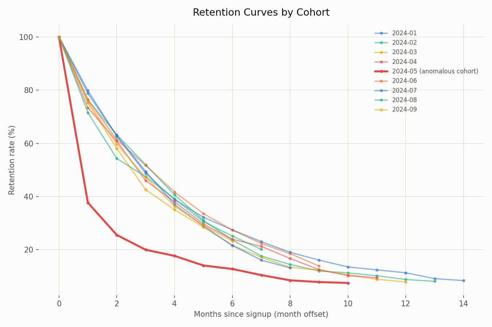
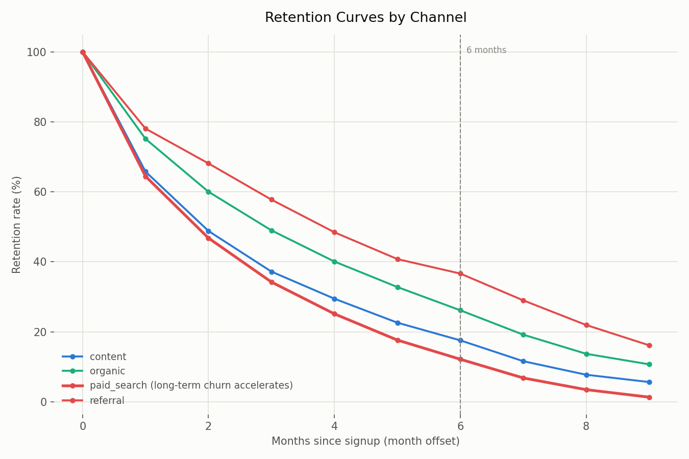

# 📊 Cohort Retention Analysis — Cohort Retention with SQL and pandas

## Overview

Cohort retention tracks how a group of users who signed up in the same month (a cohort) sticks around over time. Looking at average retention alone hides a lot — you can easily miss an onboarding problem in a specific period or a low-quality acquisition channel. The moment you break retention down by cohort, questions like "when, who, and why did they churn" start to surface.

It's one of the most fundamental analyses in product/growth work, and also a high-leverage recipe to implement: a single `groupby` plus a handful of SQL window functions get you the whole thing.

## Data

`data/cohort_activity.csv` — synthetic data for a hypothetical B2B SaaS product: 2,500 users x signup cohorts from 2024-01 through 2024-09 x monthly activity logs through 2025-03, in long format (`user_id, signup_month, plan, channel, activity_month`), roughly 10,000 rows.

- **Reproducible with a fixed seed**: `numpy.random.default_rng(42)`. Running `python generate_data.py` regenerates an identical CSV.
- **Not real business data.** With no manipulation or exaggeration, two realistic retention patterns (by plan, by channel) and two anomalies designed as an "interpretation exercise" were deliberately built in at the data-generation stage — see [Interpretation Points](#interpretation-points--what-should-you-read-from-this) below.

## Stack

- Python 3.11+ / pandas / numpy / matplotlib
- SQL (SQLite dialect, portable to most RDBMSs as standard SQL)
- `uv` (virtual environment and package management)

## Getting Started

```bash
uv venv .venv && source .venv/bin/activate
uv pip install -r requirements.txt
python generate_data.py   # generates data/cohort_activity.csv
python analysis.py        # generates 3 PNGs in assets/ + prints the retention matrix to the console
```

To run the SQL version directly:

```bash
sqlite3 cohort.db
.mode csv
.import data/cohort_activity.csv cohort_activity
.read retention.sql
```

## Analysis Steps (pandas ↔ SQL mapping)

| Step | pandas (`analysis.py`) | SQL (`retention.sql`) |
|---|---|---|
| 1. Compute months elapsed | Convert `activity_month` and `signup_month` to Period, then diff in months | Slice year/month with `substr()`, cast to int, then subtract (`user_month_offset` view) |
| 2. Cohort size (denominator) | `groupby("signup_month")["user_id"].nunique()` | `cohort_size` view — `COUNT(DISTINCT user_id)` |
| 3. Active users per cohort x month offset (numerator) | `groupby(["signup_month","month_offset"])` then `unstack` | `cohort_active` view — same GROUP BY |
| 4. Compute retention rate | numerator ÷ denominator × 100 | same operation in the `retention_long` view |
| 5. Pivot into a matrix | `unstack("month_offset")` pivots automatically | SQLite has no PIVOT, so pivot manually with `CASE WHEN ... MAX()` |
| 6. Handle unobserved periods | Offsets not yet reached (relative to the observation cutoff) are set to `NaN` explicitly | Those cohort/offset combinations simply don't exist, so they're missing naturally |

The two versions' retention matrices were cross-checked directly against each other with `sqlite3` and match exactly to one decimal place (see the verification note at the bottom for method).

## Results

### Cohort x Month-Offset Retention Heatmap



Earlier cohorts (top-left) have been observed longer, so values extend further to the right, while the most recent cohorts (bottom-right) still have unobserved future periods left blank (gray) — that's not missing data, it just means "that month hasn't happened yet."

### Retention Curves by Cohort



Most cohorts follow a similar curve, dropping to the mid-70% range by month 1, but **the 2024-05 cohort alone falls off a cliff to 38% at month 1** (red line). It stays lower than the other cohorts for every month after that too.

### Retention Curves by Channel



organic, referral, and content all converge gradually, but **paid_search is the only channel whose decline steepens noticeably after month 6** (red line; the dotted line marks the 6-month point).

## Interpretation Points — what should you read from this?

Three patterns were deliberately seeded into the data at generation time (`generate_data.py`). Try to guess the cause from the charts first, then open the collapsed explanation.

<details>
<summary><b>1. Why does the 2024-05 cohort alone crash at month 1?</b></summary>

`generate_data.py` sets `ANOMALY_COHORT = "2024-05"` and `ANOMALY_PENALTY = 0.45` — a 0.45x penalty was applied only to that cohort's month-1 retention hazard. In practice, this maps to hypotheses like "an onboarding change shipped that month actually drove churn" or "that month's acquisition campaign had mistargeted traffic." Without breaking retention down by cohort, this signal would have been buried in the overall average retention curve.
</details>

<details>
<summary><b>2. Why is the retention gap between plans so pronounced?</b></summary>

`BASE_MONTHLY_RETENTION = {free: 0.72, starter: 0.85, pro: 0.90, enterprise: 0.95}` — higher-tier plans were given a higher monthly survival probability. Real-world SaaS often shows the same pattern: paid plans, and especially enterprise deals adopted at the organizational level, tend to churn much less because switching costs (contracts, data migration, team onboarding) are high. Judging overall product health from free-plan retention alone would understate it.
</details>

<details>
<summary><b>3. Why does paid_search fall off especially fast after 6 months?</b></summary>

`PAID_SEARCH_LONG_TERM_OFFSET = 6` and `PAID_SEARCH_LONG_TERM_PENALTY = 0.85` — an extra penalty was applied to the paid_search channel starting at month 6. The assumption modeled here is that users acquired through paid search ads sign up on initial interest but have weaker intrinsic need for the product (compared to organic or referral), so once the early honeymoon period ends, churn accelerates. Judging true channel quality means looking at this long-term curve, not just short-term conversion rate, when evaluating channel CAC (customer acquisition cost).
</details>

## Limitations and Extension Ideas

- This recipe only covers "logo retention" (the assumption that once a user churns, they never come back). In reality, users can reactivate (win-back), and modeling that properly requires storing activity as a binary sequence per period and tracking reactivation rate as a separate metric.
- Revenue-based retention (net revenue retention) isn't covered here — weighting by dollar amount instead of logo count can change the picture.
- Natural follow-up recipes: **funnel analysis** (signup → activation → payment conversion, stage by stage), **A/B test evaluation** (statistical significance testing for an onboarding change), **WAU/MAU design** (rethinking the definition of an active user from scratch).

## References

- [Cohort analysis — Wikipedia](https://en.wikipedia.org/wiki/Cohort_analysis) — definition and background of cohort analysis
- [Mixpanel: How to do a cohort analysis](https://mixpanel.com/blog/cohort-analysis/) — a practitioner's guide to applying cohort retention

---

**Verification method** (record of confirming the SQL/pandas results match for this recipe): imported `data/cohort_activity.csv` into SQLite, ran `retention.sql`, and cross-checked the resulting matrix against `analysis.py`'s console output matrix across offsets 0-9 — matches exactly to one decimal place.

© 2026 BuildnWrite. All rights reserved.
