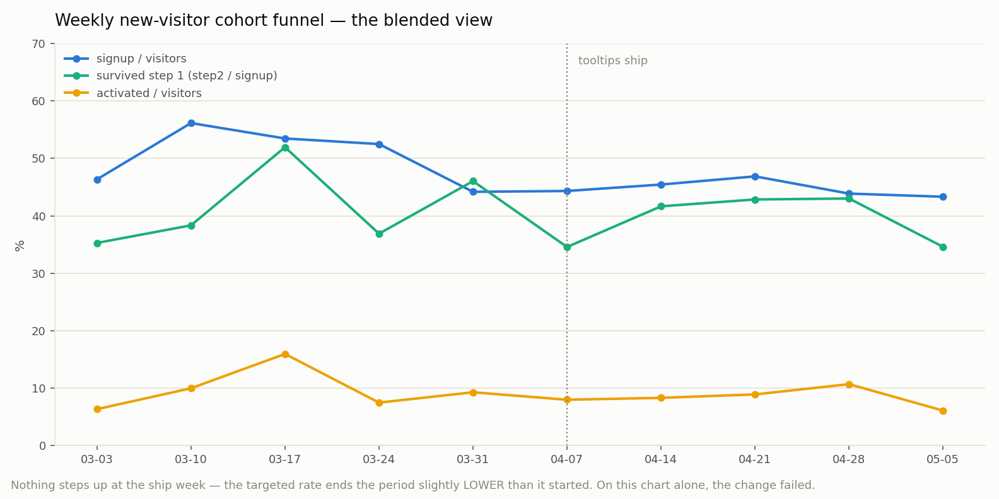
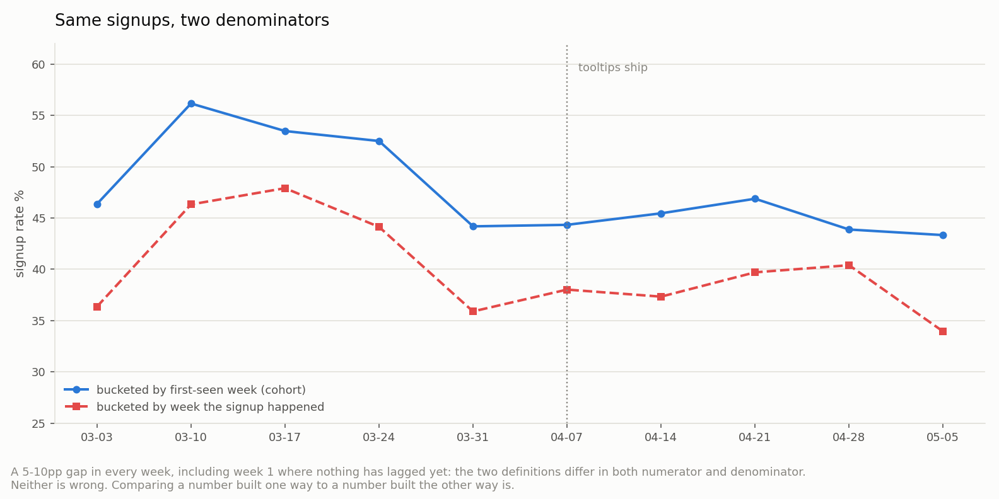
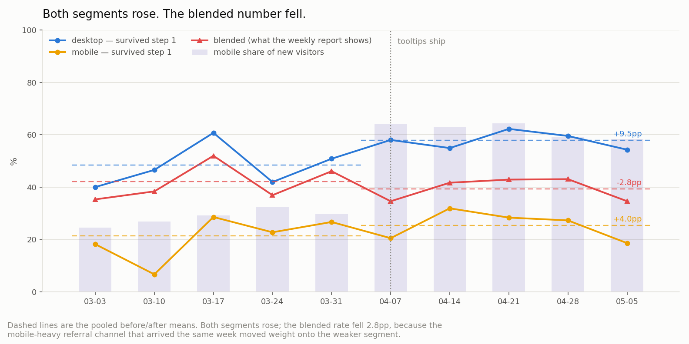
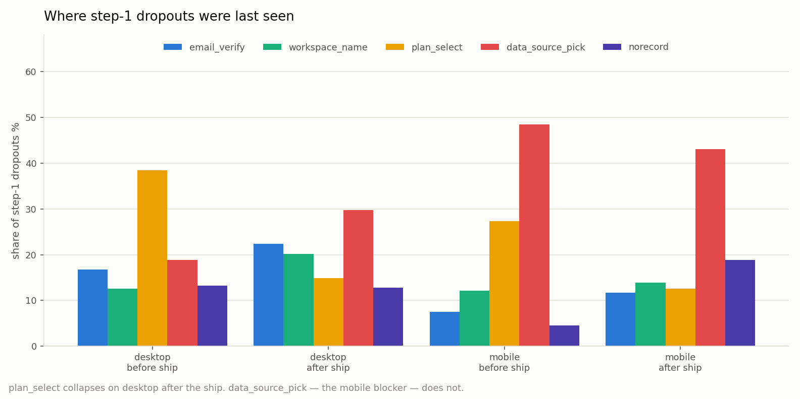

# 🕳 Weekly Funnel — Did The Thing We Shipped Actually Work?

## Overview

You shipped an onboarding change. A week later someone asks whether it worked, and you pull up the funnel. The blended number hasn't moved. Do you revert?

This recipe is the analysis that answers that question honestly. It takes a raw append-only event log — the kind you get from a hundred lines of homegrown instrumentation, not a paid analytics stack — and rebuilds the funnel four times, each pass fixing one thing the pass before it got wrong:

| Pass | What it fixes | What it changes |
|---|---|---|
| 0 | Drop the team's own IDs | Week-1 activation falls from 8.8% to 6.4% |
| 1 | Bucket by the visitor's **first-seen week**, not the calendar week | Each week's number stops absorbing other weeks' traffic |
| 2 | State the **conversion window** next to every rate | The same log reads 35.8% or 47.0% signup depending only on where you draw it |
| 3 | Split by **device** | The change that "did nothing" turns out to be +9.5pp and +4.0pp |

The punchline is pass 3. Both device segments improved after the ship, and the blended rate went **down** 2.8pp — because the same week the change shipped, a mobile-heavy referral channel moved the traffic mix toward the worse-converting segment. A team reading only the blended weekly report would have reverted a change that worked.

This is the runnable companion to [`theory/03-funnel-analysis.md`](../../theory/03-funnel-analysis.md). Where the theory guide defines steps, windows, and segment comparison, this recipe shows what happens when you skip them.

## Data

`data/telemetry.jsonl` — 6,066 synthetic events from 1,883 distinct anonymous IDs, one JSON object per line, in the shape a small self-hosted event endpoint actually writes:

```json
{"ts":"2025-03-03T08:07:56Z","anonId":"28267682b067e979","event":"visit","data":{"device":"desktop"}}
{"ts":"2025-03-03T08:09:13Z","anonId":"28267682b067e979","event":"signup","data":{"device":"desktop"}}
{"ts":"2025-03-03T08:11:11Z","anonId":"28267682b067e979","event":"stepStart","data":{"step":1}}
```

`data/actors.json` — three anonIds belonging to the team (a founder and two testers), maintained by hand. Every real product has this file, or should.

The modelled product is a hypothetical B2B SaaS onboarding: **visit → signup → step 1 (verify, name workspace, pick plan, pick data source) → step 2 (invite a teammate) → step 3 (run first report) → activated**. Ten ISO weeks of acquisition starting 2025-03-03, with the log running three weeks past the last cohort so every cohort gets a full conversion window.

- **Reproducible with a fixed seed**: `numpy.random.default_rng(42)`. Running `python generate_data.py` regenerates an identical file.
- **Not real business data.** Three patterns were deliberately built in at generation time, as an interpretation exercise — see [Interpretation Points](#interpretation-points--what-should-you-read-from-this).
- The event shape and the analysis method are ported from real production telemetry on a deployed side project; that log itself is not published. The single-window version of the same funnel, on real data, is in [`case-studies/board-game-webapp`](../../case-studies/board-game-webapp/), and the build-it-yourself instrumentation writeup is in [`instrumentation.md`](../../case-studies/board-game-webapp/instrumentation.md).

## Stack

- Python 3.11+ / numpy / matplotlib — no pandas. Raw event logs are the one place where plain dicts and `Counter` read better than a dataframe, and it keeps the port to any other language obvious
- `uv` (virtual environment and package management)

## Getting Started

```bash
uv venv .venv && source .venv/bin/activate
uv pip install -r requirements.txt
python generate_data.py   # writes data/telemetry.jsonl + data/actors.json
python analysis.py        # writes 4 PNGs to assets/ + prints every table to the console
```

## Analysis Steps

| Step | What it does | Where |
|---|---|---|
| 1. Exclude internal actors | Read `actors.json`, drop those anonIds before anything else | `load_events()` |
| 2. Collapse each visitor to funnel facts | First-seen week, deepest step, device, where they exited step 1 | `visitor_profile()` |
| 3. Apply the conversion window | Only events within 21 days of the first visit count, and report what other windows would have said | `CONVERSION_WINDOW_DAYS`, `print_window_sensitivity()` |
| 4. Group by first-seen week | The cohort denominator: new visitors that week | `group_by(profiles, "first_week")` |
| 5. Rebuild the same rates by calendar week | The naive denominator: anyone active that week | `print_cohort_vs_calendar()` |
| 6. Split by device, pool before/after the ship | Bigger n per cell, so the shift beats weekly noise | `print_device_split()` |
| 7. Break down step-1 exits by phase | Which screen people were last seen on | `print_step1_phases()` |

## Results

### 0. The exclusion list, before anything else

```
internal anonIds: 3   activated: 3/3   first-seen weeks: ['2025-03-03']
with internal actors   week 1 activation  10/113 =   8.8%   all-time   9.1%
excluded               week 1 activation   7/110 =   6.4%   all-time   9.0%
```

Three teammate IDs move week 1's activation rate by 2.4 percentage points — the number the launch gets judged on — while the all-time figure moves 0.1pp.

The mechanism is not traffic volume. Every rate here counts distinct people, so three IDs are three visitors however many sessions they log. It's that they complete every funnel they enter (3 of 3, against a 6.4% baseline for real week-1 visitors), and that all three were first seen in week 1 — so first-seen-week cohorting files their entire ten-week history under the launch cohort and no other. One week absorbs the whole distortion, and it happens to be the week everyone quotes.

### 1. The blended weekly funnel



Nothing steps up at the ship line. The rate the change targeted (green, step 2 ÷ signup) ends the period slightly *lower* than it started: 42.1% pooled before, 39.3% after. On this chart alone, the correct decision is to revert.

### 2. Two definition choices: the window, and the bucket

Before comparing any two weeks, two things have to be pinned down. Neither has a right answer; both change the number.

**The conversion window** — how long after a first visit a signup still counts as that visitor's:

```
 window  signups  cohort sgn%  lagged   vs 21d
     1d      673         35.8       1    -11.2
     7d      747         39.7      58     -7.2
    14d      858         45.6     169     -1.3
    21d      883         47.0     194     +0.0
    60d      883         47.0     194     +0.0
```

An 11.2-point spread on identical data, wider than any product effect in this recipe. Returners account for all of it: at a 1-day window almost none have come back yet. Widening past 21 days changes nothing *here*, because no visitor in this log converts later than day 16 — a fact about this dataset, not a general one. Measure it rather than inheriting a default.

**The bucket** — which week a signup belongs to:



The same signups, counted two ways, differ by 3.5–10.0 percentage points in **every** week — including week 1, where no conversion has lagged in from anywhere yet. The two definitions disagree in both numerator (which signups belong to this week) and denominator (new visitors vs everyone active).

By the last week, 17 of that week's signups came from people who first arrived in an earlier week. Neither definition is wrong. Comparing a number built one way against a number built the other way is.

### 3. The same funnel, split by device



```
segment        before      n    after      n   change
desktop          48.4    277     57.8    223     +9.5
mobile           21.4     84     25.4    299     +4.0
blended          42.1    361     39.3    522     -2.8
```

Both segments rose. The blend fell. Mobile share of new visitors went from roughly 30% to roughly 60% in the ship week, and mobile converts at less than half the desktop rate, so the mix shift more than cancelled a real gain. This is [Simpson's paradox](https://en.wikipedia.org/wiki/Simpson%27s_paradox) in its most ordinary product-analytics form — no exotic data required, just a marketing win and a product win landing in the same week.

Note the dashed pooled means on the chart. Weekly n here is 11–83 signups per device cell; at that size the week-to-week wobble is mostly sampling noise, and reading individual weeks would have you declaring victory in one week and defeat the next.

### 4. Where inside step 1 people were last seen



| device | period | email_verify | workspace_name | plan_select | data_source_pick | norecord | n |
|---|---|---|---|---|---|---|---|
| desktop | before | 17% | 13% | **38%** | 19% | 13% | 143 |
| desktop | after | 22% | 20% | **15%** | 30% | 13% | 94 |
| mobile | before | 8% | 12% | 27% | **48%** | 5% | 66 |
| mobile | after | 12% | 14% | 13% | **43%** | 19% | 223 |

This is the part you can act on. On desktop, `plan_select` — the screen the tooltips targeted — collapses from 38% of exits to 15%. The tooltips did what they were built to do.

On mobile, `data_source_pick` stays the single largest exit before *and* after, at 48% then 43%. The tooltips never touched the mobile blocker, and mobile is now the majority of traffic. That's the next ticket, and it isn't "improve onboarding" — it's one screen.

`norecord` (no exit event captured at all, because the browser closed first) runs 5–19%. Any client-side event log has this; report it as its own bucket rather than silently redistributing it.

## Interpretation Points — what should you read from this?

Three patterns were seeded into the data at generation time (`generate_data.py`). Try to explain each from the charts first, then open the collapsed answer.

<details>
<summary><b>1. Why did both device segments improve while the blend got worse?</b></summary>

`TOOLTIP_LIFT = {"desktop": 1.45, "mobile": 1.44}` applies from `SHIP_WEEK_INDEX = 5` onward, so both segments genuinely convert better after the ship. In the same week, `MOBILE_SHARE` jumps from ~0.30 to ~0.64.

Because `P_STEP2` is 0.44 for desktop and 0.18 for mobile, mobile visitors carry a much lower rate into the average. Shifting a third of the traffic weight onto the weaker segment subtracts more than the treatment adds, so the weighted average falls even though every component rose. The blended rate is a weighted average, and you changed the weights.

The practical rule: whenever a funnel number moves, check whether the *population* moved before concluding the *product* did. A rate can only be compared across periods if the mix behind it is stable — or if you hold it fixed by segmenting.
</details>

<details>
<summary><b>2. Why do cohort-week and calendar-week bucketing disagree even in week 1?</b></summary>

`RETURN_RATE = 0.28` and `RETURN_SIGNUP_MULT = 1.6`: 28% of visitors who don't sign up on their first visit come back 3–16 days later, and returners sign up at 1.6× the first-visit rate.

Calendar bucketing puts those returners' signups in the week they converted and their extra visit in that week's denominator. Cohort bucketing keeps both with the week they first arrived. So week 1 already differs: some week-1 visitors sign up in week 2, which the calendar view credits to week 2.

The consequence is that a calendar-week rate reacts to last week's traffic. After a spike, the following weeks carry a tail of lagged converters who arrived under different conditions — so the metric moves without anything about this week having changed. Cohort bucketing is what makes "week 6 is better than week 5" a statement about weeks 5 and 6.
</details>

<details>
<summary><b>3. Why does the team's own traffic distort week 1 and nothing else?</b></summary>

Two generator settings combine. `P_INTERNAL_ACTIVATE = 0.82` means the team completes almost every funnel they enter, because they know where every button is — in this seed, 3 of 3. And `INTERNAL_SESSIONS_PER_WEEK` starts at week 1, so all three IDs are first seen in the launch week.

The tempting explanation is volume: 26 internal sessions in week 1, tapering to 5. That explanation is wrong for this analysis. `visitor_profile()` collapses each anonId to one row, so those 26 sessions are three visitors, and session counts never enter any rate.

What actually happens is attribution. First-seen-week cohorting assigns a visitor to one week forever, so the team's entire ten-week history lands in the week-1 cohort: 10/113 instead of 7/110. Every later week is untouched, and the all-time number moves 0.1pp. The distortion is not spread thin across the period — it is concentrated entirely in the week the launch gets judged on.

The general shape: any small group of unrepresentative users first seen in one period will deform that period alone under cohort bucketing. A checked-in `actors.json` is the whole fix, and it has to exist before you need it — reconstructing "which of these IDs was me" from a log afterwards is guesswork.

</details>

## Limitations

- **Device is attributed from the first visit** and treated as fixed. Real visitors switch — read something on a phone, come back on a laptop — and a serious version of this analysis has to decide whether the segment key is the first visit, the converting session, or the modal device, and say which.
- **Cohorts that straddle the ship date are contaminated.** A visitor whose first week was pre-ship but who returns and signs up post-ship is counted in a "before" cohort while receiving the treatment. The effect here is small (return gaps cap at 16 days) but it biases the measured lift downward. A cleaner design assigns treatment at the signup event and reports it as its own axis.
- **This is not an A/B test.** Before/after comparison across a period where the traffic mix also changed cannot isolate the tooltips' causal effect — the whole recipe is a demonstration of that. For the version that can, see [`theory/04-ab-testing.md`](../../theory/04-ab-testing.md).
- **`norecord` is unmodelled loss.** 5–19% of step-1 exits have no exit event, and there's no way to know whether those users resemble the ones who did fire an event.
- **Weekly cells are small.** 11–83 signups per device-week means roughly ±5–15pp of sampling noise on each point. That's why every conclusion here is drawn from pooled before/after cells, not individual weeks.
- Natural follow-ups: **A/B test evaluation** (running this properly as an experiment), and a **measurement-definition guide** — how to pin down what a baseline number meant before comparing anything to it.

## References

- [Funnel analysis — Wikipedia](https://en.wikipedia.org/wiki/Funnel_analysis) — definition and background
- [Simpson's paradox — Wikipedia](https://en.wikipedia.org/wiki/Simpson%27s_paradox) — why an aggregate can move opposite to every one of its parts
- [`theory/03-funnel-analysis.md`](../../theory/03-funnel-analysis.md) — steps, conversion windows, segment comparison, and the sample sizes each needs
- [`case-studies/board-game-webapp`](../../case-studies/board-game-webapp/) — the single-window version of this funnel on real production data

---

**Verification method**: `python generate_data.py && python analysis.py` from a clean `uv venv`, on the pinned versions in `requirements.txt`. Every number quoted above is copied from that console output, and all four PNGs in `assets/` are the ones that run produced.

© 2026 BuildnWrite. All rights reserved.
