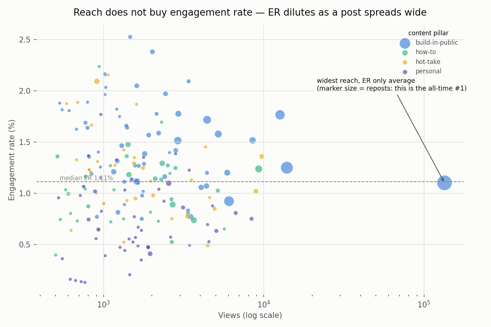
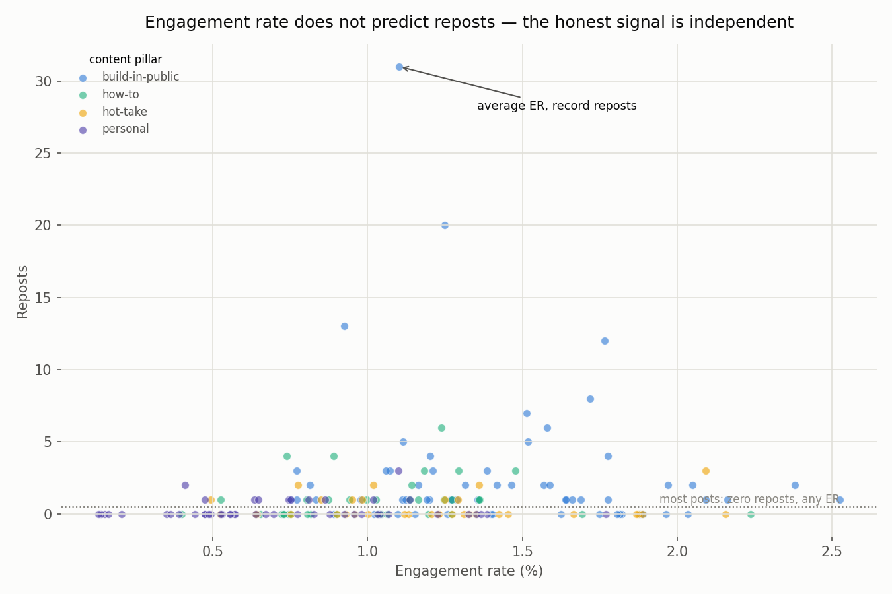
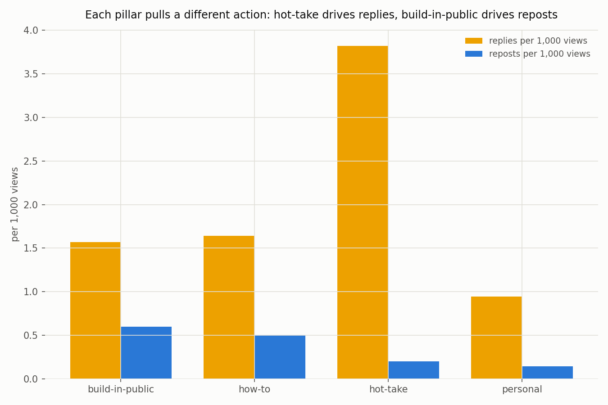

# 🧵 Threads Engagement Analysis — Why Engagement Rate Alone Misranks Your Best Post

## Overview

You shipped a content account instead of an app — a Threads profile, a Substack, a LinkedIn feed. It still has users (your audience), a reach funnel (impressions → engagement → follows), and a retention question (which content makes people come back and bring others). That makes it a product, and product-analytics thinking applies directly.

The trap most people fall into is ranking posts by **engagement rate** (`(likes + replies + reposts) / views`) and calling it a day. Engagement rate is a *precision-of-reach* metric — it tells you how tightly a post landed with the audience it reached — but on its own it systematically misfiles your best work. A post the algorithm blasts to a wide, loosely-targeted audience has its engagement rate **diluted** even when its absolute pull is enormous. Judge it by the ratio and you shrug; judge it by **reposts** (people actively putting it on their own feed) and you've found the thing to build a series around.

This recipe takes a Threads account's post history and reads it the way you'd read a product: against a **baseline**, across **multiple signals**, and broken down by **content pillar** — so you stop rewarding vanity reach and start finding what actually resonates.

> Where this sits in the [AARRR](../../theory/01-product-metrics.md) frame: reach is Acquisition, engagement is Activation, and reposts/shares are Referral — the audience doing your distribution for you. It's the same [funnel thinking](../../theory/03-funnel-analysis.md), pointed at an audience instead of a signup flow. (You could call it "social/marketing analytics"; the mechanics are ordinary product analytics.)

## Data

`data/threads_posts.csv` — synthetic post history for one content account: **240 posts** over four months (2025-01 → 2025-04), one row per post:

```
post_id, published_at, track, theme, views, likes, replies, reposts, quotes
```

- `track` — coarse split: `professional` vs `daily`
- `theme` — content pillar: `build-in-public`, `how-to`, `hot-take`, `personal`
- `views, likes, replies, reposts, quotes` — the raw counts every social API returns

**Reproducible with a fixed seed** (`numpy.random.default_rng(42)`): running `python generate_data.py` regenerates a byte-identical CSV. **Not real account data** — reach is drawn from a heavy right-skewed (lognormal) distribution and engagement from per-view rates that differ by pillar, with three patterns deliberately built in as an [interpretation exercise](#interpretation--what-should-you-read-from-this).

**Want to run this on your OWN account?** See **[connect-meta.md](connect-meta.md)** — it walks through creating a Meta app, getting a Threads API token, and pulling your real posts + insights into the exact same CSV shape. Everything below then runs unchanged on your data. (Kept separate so this recipe runs offline, with zero credentials, in under a minute.)

## Stack

- Python 3.11+ / pandas / numpy / matplotlib
- `uv` (virtual environment and package management)
- No API keys, no network — the default path is fully offline.

## How to Run

```bash
uv venv .venv && source .venv/bin/activate
uv pip install -r requirements.txt
python generate_data.py   # writes data/threads_posts.csv
python analyze.py         # writes 3 PNGs to assets/ + prints the tables below
```

## Analysis Steps

1. **Filter sparse-signal posts.** Drop anything under `MIN_VIEWS = 500` — below that, one stray like swings the percentage wildly and the rates are noise.
2. **Compute per-post rates.** `like_rate`, `reply_rate`, and `engagement_rate = (likes + replies + reposts) / views × 100`.
3. **Build the account baseline.** Median / mean / max for views, likes, ER%, and reposts. Every post is read against *this*, not against zero — "84 likes" means nothing until you know the median is 13.
4. **Expose the engagement-rate trap.** Rank posts by ER, then by reposts, and compare the two top-8 lists. They barely overlap.
5. **Profile each content pillar.** Average ER, reply rate, and reposts-per-view by theme, plus a percentile letter grade — to see which pillar earns which *kind* of engagement.

## Results

### 1. Reach does not buy engagement rate



Engagement rate does **not** climb with reach — the cloud is flat as you move right. The account's single widest post (far right, ~134k views) sits right on the **median** ER line, looking utterly ordinary. Marker size is reposts: that same "ordinary" post is the biggest dot on the chart.

### 2. Engagement rate does not predict reposts



Reposts are a **sparse, independent** signal. About half the posts have zero reposts at *every* engagement-rate level (the dotted baseline), and the posts that do get reposted are scattered across the whole ER range — high ER doesn't buy them. The widest post is the all-time repost record (**31 reposts**) while its engagement rate is merely the **49th percentile**. Rank on ER and it's your 90-somethingth-best post; rank on reposts and it's #1.

```
The widest-reach post (p0133, 134,184 views):
  engagement rate 1.10%  -> only the 49th percentile (looks ordinary)
  reposts 31             -> rank #1 all-time (its content is the account's best)

Top 8 by engagement rate vs top 8 by reposts: almost no overlap.
```

### 3. Each pillar pulls a different action



| pillar | n | avg views | avg ER% | avg reply_rate | reposts/post | grade |
|---|---|---|---|---|---|---|
| build-in-public | 62 | 4,586 | 1.45 | 0.19 | 2.74 | **A** |
| how-to | 37 | 2,008 | 1.04 | 0.17 | 1.00 | C |
| hot-take | 34 | 2,218 | 1.20 | 0.43 | 0.44 | **B** |
| personal | 48 | 2,032 | 0.73 | 0.09 | 0.29 | D |

Read the **shape**, not just the grade. `hot-take` grades mid on engagement rate yet pulls by far the most **replies** — it's a debate engine, not a save engine. `build-in-public` earns the most **reposts** per view — people file it away to act on later. Two different jobs; a single ER ranking flattens both into one misleading number.

## Interpretation — what should you read from this?

Three patterns were seeded into the data at generation time (`generate_data.py`). Try to read them off the charts first, then open each explanation.

<details>
<summary><b>1. Why is the widest-reach post only median on engagement rate but #1 on reposts?</b></summary>

`ANOMALY_VIEWS_MULT = 8` blasts one build-in-public post's reach 8x, but its like/reply *rates* are set below the account's niche peak (`ANOMALY_DILUTED_LIKE_RATE = 0.0095` vs the pillar's `0.0115`). A wide algorithmic push reaches a looser audience, so the *percentage* engaging drops even as absolute counts soar — its ER dilutes to the middle of the pack. Reposts, though, are pinned to an all-time high: reach × genuine save-value. The lesson mirrors how real accounts behave — the post that travels furthest is often the one ER underrates, and reposts are the tell. **Judge on ER alone and you'd never make a series of your best-performing idea.**
</details>

<details>
<summary><b>2. Why do reposts stay near zero across every engagement-rate level?</b></summary>

Every pillar's `repost_rate` is set an order of magnitude below its `like_rate` (e.g. build-in-public `0.00095` vs `0.0115`), so a repost is intentionally *rare*. That's realistic: a like is a reflex, a repost is a public endorsement someone attaches their name to. Because it's rare and costly, it's the most honest quality signal you have — but you can't see it if you average it into a blended engagement rate, where the likes drown it out. **Track reposts as their own metric; a single one already outranks a hundred passive likes.**
</details>

<details>
<summary><b>3. Why does hot-take grade lower than build-in-public but win on replies?</b></summary>

`hot-take` carries the highest `reply_rate` (`0.0040`) but a low `repost_rate` (`0.00022`); `build-in-public` is the reverse. Engagement rate weights all reactions equally, so hot-take's reply surge doesn't rescue its grade — yet replies are exactly what you want if the goal is discussion, reach via the algorithm's conversation boost, or surfacing objections. **Grade against the job the pillar is meant to do, not one universal ratio** — a debate pillar and a save pillar should not be measured on the same number.
</details>

## Limitations

- **Own-account only.** The Threads API (like most social insight APIs) returns metrics only for the authenticated account's own posts — this is first-party analytics, not competitor scraping.
- **No causality.** This is descriptive. "build-in-public earns reposts" is an association in one account's history, not proof that switching pillars will move your numbers — for that you'd run an [A/B test](../../theory/04-ab-testing.md).
- **Reach is exogenous and noisy.** The algorithm decides distribution; a single viral post can dominate a month. Look at medians and per-view rates, not totals, and don't over-read one spike.
- **Follower conversion isn't modeled.** Views → follows is the acquisition step that actually grows the account; this recipe stops at on-post engagement. Pulling `followers_count` over time (the API exposes it) is the natural next extension.
- **Synthetic data.** Patterns here are the ones we injected. On your own data (via [connect-meta.md](connect-meta.md)) the shapes will differ — that's the point.

## References

- [Threads API — Insights](https://developers.facebook.com/docs/threads/insights) — the `views, likes, replies, reposts, quotes` metrics this recipe consumes
- [AARRR / Pirate Metrics](https://www.productplan.com/glossary/aarrr-framework/) — the acquisition-to-referral frame this analysis maps onto
- Theory in this repo: [Product Metrics](../../theory/01-product-metrics.md) (engagement, vanity metrics) · [Funnel Analysis](../../theory/03-funnel-analysis.md)

---

© 2026 BuildnWrite. All rights reserved.
